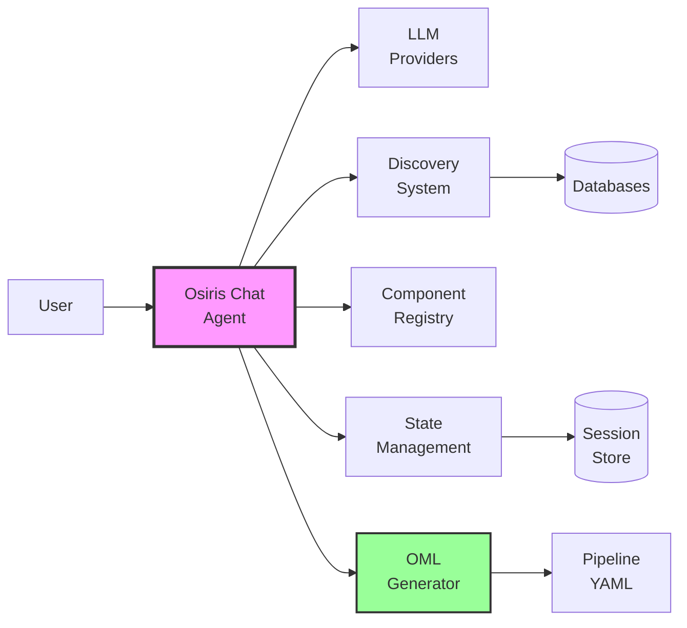
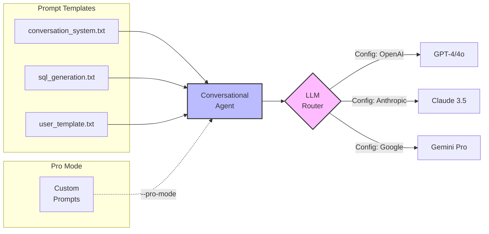
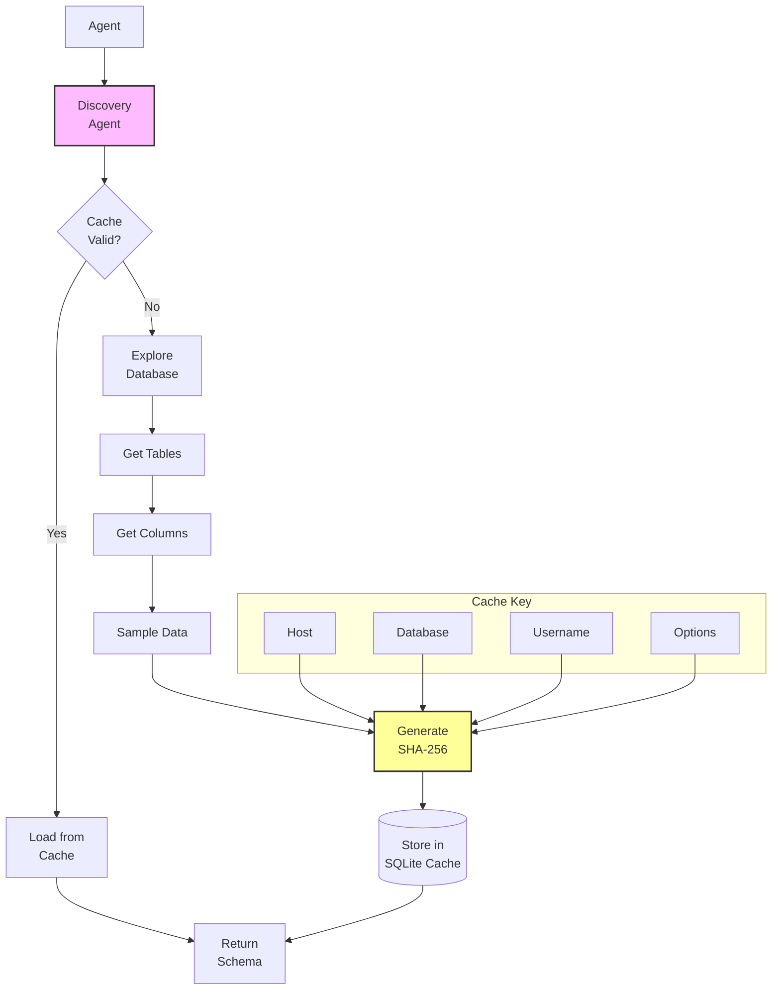
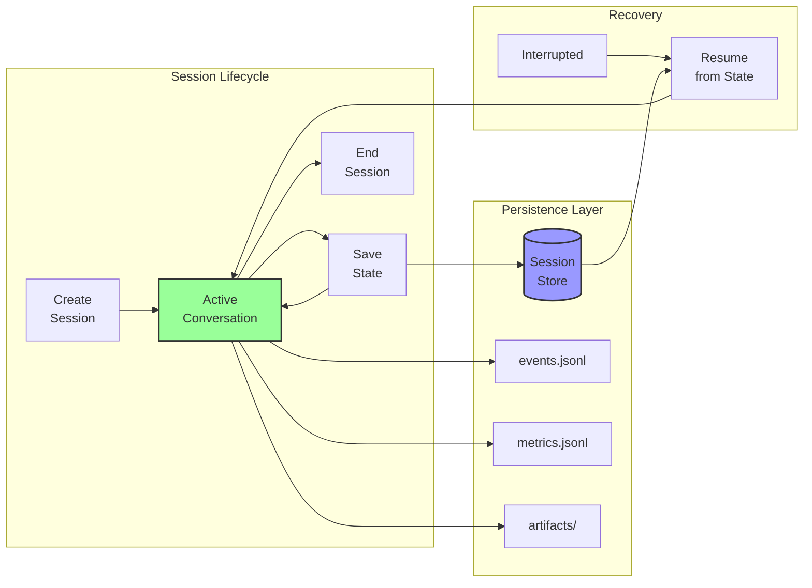
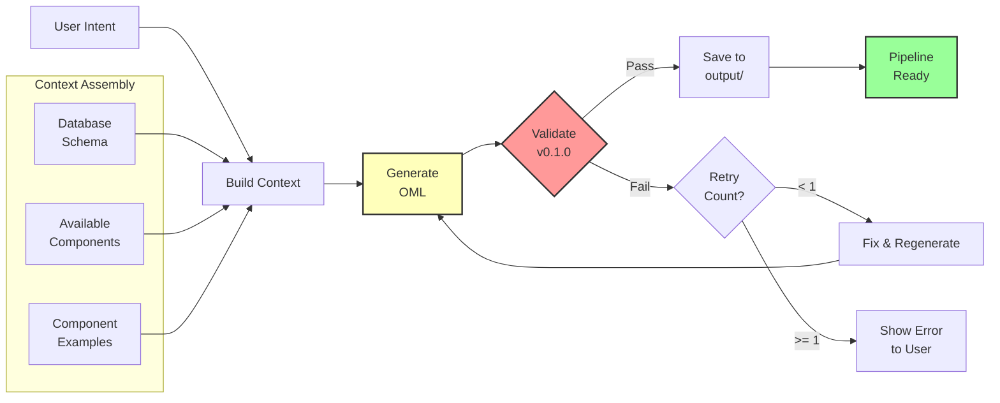
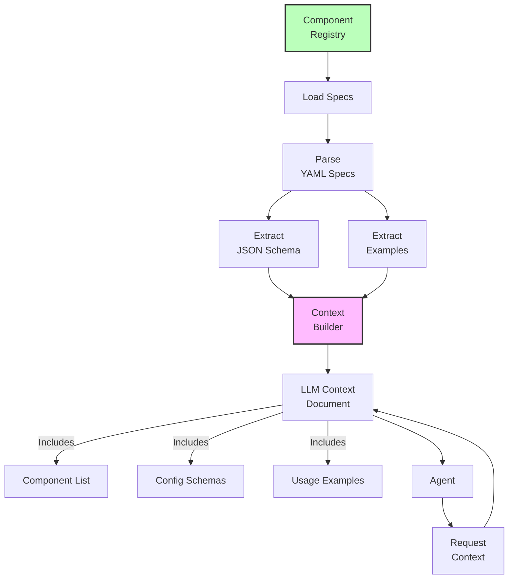
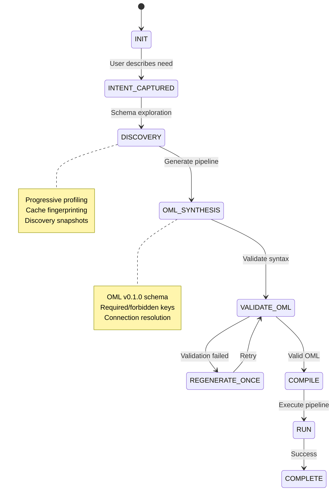
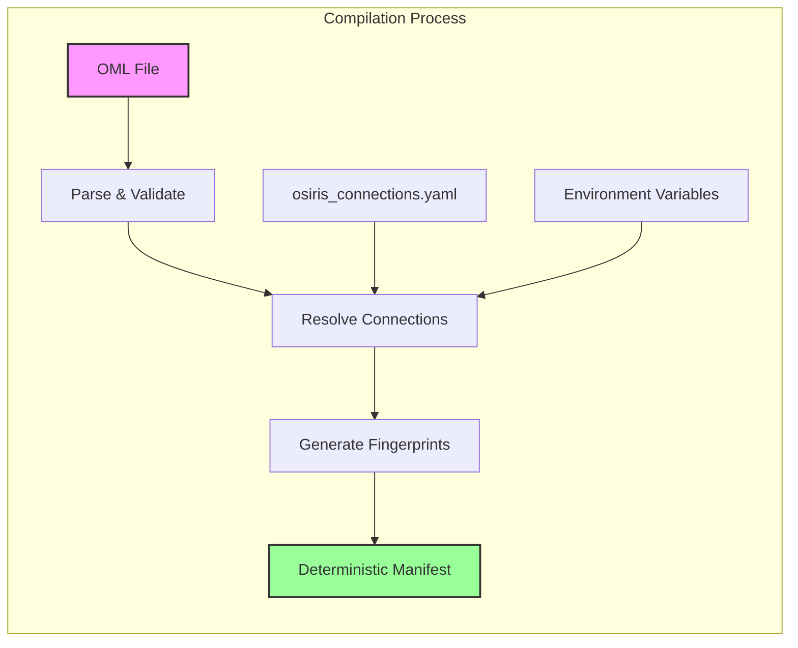
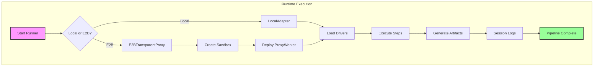

# Osiris Architecture

**Date:** 2025-09-22
**Version:** v0.2.0
**Status:** Milestone M1 — Component Registry & Runner (release)
**Purpose:** A lightweight overview of how Osiris compiles conversational intent into deterministic, production‑ready data pipelines.

---

## System Overview

Osiris turns business intent into a deterministic pipeline you can run locally or in an E2B cloud sandbox with identical behavior.

```
Intent (chat / YAML) → OML (v0.1.0) → Compile (deterministic manifest) → Run (Local | E2B) → Logs & HTML report
```

### High‑level flow


---

## Core Concepts

### OML (Osiris Markup Language) — v0.1.0
A concise, YAML‑based pipeline spec. It references connections by alias (e.g. `@mysql.db_movies`) and uses self‑describing components.

- **Deterministic input** to the compiler
- **Versioned** alongside your code
- **No secrets** inside (only references)

### Deterministic Compiler
Validates the OML against component specs, resolves dependencies, and emits a **fingerprinted manifest**. Same inputs → same manifest, every time.

- JSON Schema validation against the **Component Registry**
- Secrets remain references; never embedded in artifacts
- Produces a plan the Runner can execute anywhere

### Runner & Execution Adapters
One runner, multiple environments with **full parity**:

- **Local Adapter:** executes on your machine
- **E2B Transparent Proxy:** spins an ephemeral sandbox and streams live events back

Both paths yield the **same logs, metrics, and artifacts**.

### Component Registry (Self‑describing)
Components declare capabilities and config via JSON Schema. The registry powers:

- Strict validation & guardrails
- Human‑readable errors
- LLM context generation (for chat)

### Connections & Secrets
Non‑secret connection metadata lives in `osiris_connections.yaml` (versioned). Secrets are provided via environment variables. The compiler and runtime resolve `@family.alias` at execution time.

### Observability by Default
Every run produces a structured session:

```
logs/<session>/
  ├─ events.jsonl
  ├─ metrics.jsonl
  └─ artifacts/
```

`osiris logs html --open` renders an interactive report with **rows processed, durations, per‑step details**, and environment badges (Local / E2B).

### Security Boundaries
- **SQL Safety**: Context-aware validation - read-only for extractors, controlled writes for loaders. See [SQL safety rules](reference/sql-safety.md).
- **Secrets Isolation**: Never stored in OML or compiled manifests, resolved at runtime only.
- **Connection Validation**: Driver-level enforcement of permissions per execution context.

---

## Architecture at a Glance


---

## What's in v0.2.0 (M1)

- ✅ **Compiler** for OML v0.1.0 → deterministic manifests (with SHA‑256)
- ✅ **Runner** with **Local** and **E2B Transparent Proxy** adapters (full parity)
- ✅ **Component Registry** with JSON Schema specs (MySQL extractor, Supabase writer, CSV writer, …)
- ✅ **Connections & Secrets** via `osiris_connections.yaml` + environment variables
- ✅ **Observability**: structured events/metrics, HTML reports, environment badges
- ✅ **Row totals normalization** and **verbose streaming** parity (Local ↔ E2B)

### Not in this version (tracked in ADRs)

- ⏭️ **Streaming I/O** / RowStream API (ADR‑0022)
- ⏭️ **Remote object store writers** (S3/Azure/GCS) (ADR‑0023)
- ⏳ **Run export/context bundle** (ADR‑0027) — foundation exists; integration planned for M2

---

## CLI Quick Reference

```bash
# Compile OML to a deterministic manifest
osiris compile path/to/pipeline.yaml

# Run last compiled manifest locally (verbose)
osiris run --last-compile --verbose

# Run in E2B sandbox (installs deps in sandbox on first run)
osiris run --last-compile --e2b --e2b-install-deps --verbose

# Open HTML report for the last run
osiris logs html --open

# List components and connections
osiris components list
osiris connections list
```

---

## Detailed Architecture Diagrams

### Conversational Agent Architecture

The `osiris chat` command implements a sophisticated AI agent that orchestrates multiple subsystems.

#### High-Level Agent Architecture

This overview shows the main components and data flow:



#### Detailed Component Interactions

Here's how the agent orchestrates its subsystems:

```mermaid
graph TB
    subgraph "Osiris Chat Agent"
        User[User Input] --> Agent[Conversational Agent]

        Agent --> LLMRouter[LLM Router]

        subgraph "LLM Providers"
            OpenAI[OpenAI<br/>GPT-4/GPT-4o]
            Claude[Anthropic<br/>Claude 3.5]
            Gemini[Google<br/>Gemini]
        end

        LLMRouter --> OpenAI
        LLMRouter --> Claude
        LLMRouter --> Gemini

        subgraph "System Prompts"
            ConvPrompt[conversation_system.txt]
            SQLPrompt[sql_generation_system.txt]
            UserPrompt[user_prompt_template.txt]
        end

        Agent --> ConvPrompt
        Agent --> SQLPrompt
        Agent --> UserPrompt

        subgraph "Discovery Subsystem"
            Discovery[Discovery Agent]
            SchemaCache[(Schema Cache<br/>SQLite)]
            Fingerprint[Cache Fingerprint<br/>SHA-256]

            Discovery --> SchemaCache
            Discovery --> Fingerprint
            Fingerprint --> |Invalidate| SchemaCache
        end

        Agent --> Discovery

        subgraph "Component Registry"
            Registry[Component Registry]
            Specs[Component Specs<br/>JSON Schema]
            Context[LLM Context Builder]

            Registry --> Specs
            Registry --> Context
        end

        Agent --> Registry
        Context --> |Component Context| Agent

        subgraph "State Management"
            StateStore[(Session Store<br/>SQLite)]
            SessionLog[Session Logger]
            Events[events.jsonl]
            Metrics[metrics.jsonl]

            StateStore --> |Persist| Agent
            Agent --> SessionLog
            SessionLog --> Events
            SessionLog --> Metrics
        end

        Agent --> StateStore

        subgraph "OML Generation"
            OMLGen[OML Generator]
            Validator[OML Validator<br/>v0.1.0 Schema]
            Regenerate[Regeneration<br/>Logic]

            OMLGen --> Validator
            Validator --> |Failed| Regenerate
            Regenerate --> OMLGen
        end

        Agent --> OMLGen

        subgraph "Data Sources"
            MySQL[(MySQL)]
            Supabase[(Supabase)]
            CSV[CSV Files]
        end

        Discovery --> MySQL
        Discovery --> Supabase
        Discovery --> CSV
    end

    OMLGen --> Output[OML Pipeline<br/>output/pipeline.yaml]

    style Agent fill:#f9f,stroke:#333,stroke-width:4px
    style LLMRouter fill:#bbf,stroke:#333,stroke-width:2px
    style Discovery fill:#fbf,stroke:#333,stroke-width:2px
    style Registry fill:#bfb,stroke:#333,stroke-width:2px
    style OMLGen fill:#ffb,stroke:#333,stroke-width:2px
```



#### LLM Integration Layer

The agent supports multiple LLM providers with dynamic routing:



#### Discovery & Caching System

Intelligent database exploration with fingerprint-based caching:



#### State & Session Management

Persistent conversation state with recovery capabilities:



#### OML Generation Pipeline

The synthesis and validation loop for pipeline creation:



#### Component Registry Integration

How the agent leverages component specifications:



### Agent Capabilities and Interactions

The Conversational Agent orchestrates multiple sophisticated capabilities:

#### 1. **Multi-Provider LLM Integration**
- Routes requests to appropriate LLM provider based on configuration
- Supports OpenAI (GPT-4, GPT-4o), Anthropic (Claude 3.5), Google (Gemini)
- Handles provider-specific prompt optimization
- Manages token usage and rate limiting

#### 2. **Dynamic Prompt System**
- Loads system prompts from configurable templates
- Supports pro mode with custom prompts (`--pro-mode`)
- Combines conversation, SQL generation, and user context prompts
- Adapts prompts based on conversation state

#### 3. **Intelligent Discovery**
- **Progressive Profiling**: Explores only needed tables/columns
- **Cache Management**: SHA-256 fingerprinting prevents stale data
- **Automatic Invalidation**: Detects schema changes
- **Lazy Loading**: Fetches data only when required
- **Sample Data**: Retrieves example rows for context

#### 4. **Component Context Building**
- Reads component specifications from registry
- Builds LLM-friendly context with available components
- Includes examples and configuration schemas
- Validates component availability before OML generation

#### 5. **State Persistence**
- **Session Management**: SQLite-based conversation history
- **Recovery**: Resumes interrupted conversations
- **Context Preservation**: Maintains discovery results across turns
- **Audit Trail**: Complete conversation logging

#### 6. **OML Synthesis Loop**
- **Generation**: Creates OML based on user intent
- **Validation**: Checks against v0.1.0 schema
- **Regeneration**: One retry attempt on validation failure
- **Deterministic Output**: Same conversation produces same pipeline

#### 7. **Observability Integration**
- Structured event logging for each state transition
- Performance metrics collection
- Error tracking with context
- Session artifacts preservation

### Chat to OML State Machine

The conversational flow follows a deterministic state machine:



### Compilation Pipeline

The compilation process ensures deterministic, secret-free artifacts:



### Runtime Execution Flow

Pipeline execution adapts to local or E2B environments:



---

## Design Principles (Why it works)

1. **Determinism** — compilers over ad‑hoc glue; identical inputs → identical outputs
2. **Parity** — same behavior locally and in cloud sandboxes
3. **Transparency** — self‑describing components, explainable failures, rich logs
4. **Separation of concerns** — specs in the registry, secrets out of artifacts
5. **Open by default** — Apache 2.0 core; adopt gradually and run anywhere

---
