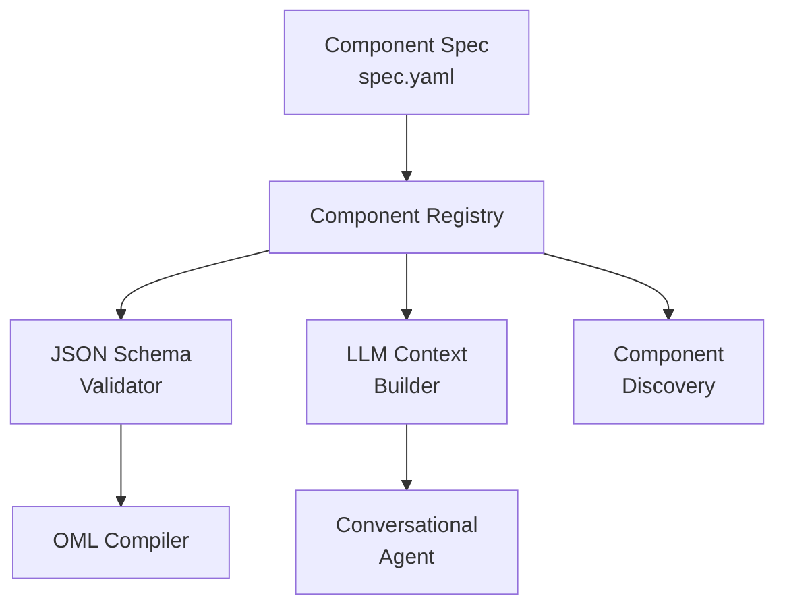

# Components Module Documentation

## Overview
The Components module (`osiris/components/`) manages the Component Registry system that provides self-describing components with JSON Schema validation.

## Module Structure
```
osiris/components/
├── registry.py           # Component registry implementation
├── validator.py          # JSON Schema validation
├── spec_loader.py        # Component spec loading
└── context_builder.py    # LLM context generation
```

## Component Architecture



## Component Specification Format

### spec.yaml Structure

```yaml
# Component specification
name: "mysql.extractor"
version: "1.0.0"
description: "Extract data from MySQL databases"
author: "Osiris Team"
tags: ["database", "sql", "extractor"]

# Configuration schema (JSON Schema)
config_schema:
  type: object
  required: ["connection", "query"]
  properties:
    connection:
      type: string
      pattern: "^@[a-z]+\\.[a-z]+$"
      description: "Connection reference (e.g., @mysql.default)"
    query:
      type: string
      minLength: 1
      description: "SQL SELECT query"
    timeout:
      type: integer
      minimum: 1
      maximum: 3600
      default: 30
      description: "Query timeout in seconds"

# Component capabilities
capabilities:
  modes: ["read"]  # read, write, or transform
  features: ["batch", "streaming"]
  doctor:
    enabled: true
    checks: ["connectivity", "permissions"]

# Secret fields (for masking)
secrets:
  fields:
    - path: "/resolved_connection/password"
      description: "Database password"
      env_var: "MYSQL_PASSWORD"
      required: true

# Output schema
output_schema:
  type: object
  properties:
    df:
      type: "DataFrame"
      description: "Extracted data as pandas DataFrame"

# Examples for LLM context
examples:
  - description: "Extract all users"
    config:
      connection: "@mysql.default"
      query: "SELECT * FROM users"

  - description: "Extract with timeout"
    config:
      connection: "@mysql.production"
      query: "SELECT * FROM large_table LIMIT 1000"
      timeout: 60
```

## Key Components

### registry.py - Component Registry

**Core Registry Class:**
```python
class ComponentRegistry:
    """Central registry for self-describing components."""

    def __init__(self):
        self._components = {}
        self._validators = {}
        self._load_all_specs()

    def register(self, spec: dict):
        """Register a component specification."""
        name = spec["name"]
        version = spec["version"]

        # Create validator from schema
        if "config_schema" in spec:
            self._validators[name] = self._create_validator(
                spec["config_schema"]
            )

        # Store spec
        self._components[name] = ComponentSpec(spec)

    def get_spec(self, name: str) -> ComponentSpec:
        """Get component specification."""
        if name not in self._components:
            raise ComponentNotFoundError(f"Component {name} not found")
        return self._components[name]

    def validate_config(self, name: str, config: dict) -> bool:
        """Validate configuration against schema."""
        if name not in self._validators:
            return True  # No schema to validate against

        validator = self._validators[name]
        validator.validate(config)  # Raises on error
        return True
```

**Component Discovery:**
```python
def discover_components(self, base_path: str = "components/"):
    """Discover all component specifications."""
    components = []

    for spec_file in Path(base_path).glob("**/spec.yaml"):
        try:
            spec = yaml.safe_load(spec_file.read_text())
            components.append(spec)
            self.register(spec)
        except Exception as e:
            logger.warning(f"Failed to load {spec_file}: {e}")

    return components
```

### validator.py - JSON Schema Validation

**Schema Validator:**
```python
import jsonschema
from jsonschema import Draft202012Validator

class ConfigValidator:
    """Validate component configurations."""

    def __init__(self, schema: dict):
        self.schema = schema
        self.validator = Draft202012Validator(schema)

    def validate(self, config: dict) -> None:
        """Validate configuration against schema."""
        errors = list(self.validator.iter_errors(config))

        if errors:
            # Format errors for clarity
            error_messages = []
            for error in errors:
                path = ".".join(str(p) for p in error.path)
                error_messages.append(
                    f"  - {path}: {error.message}"
                )

            raise ValidationError(
                f"Configuration validation failed:\n" +
                "\n".join(error_messages)
            )

    def get_defaults(self) -> dict:
        """Extract default values from schema."""
        defaults = {}

        def extract_defaults(schema, path=""):
            if "properties" in schema:
                for key, prop in schema["properties"].items():
                    if "default" in prop:
                        defaults[f"{path}{key}"] = prop["default"]
                    extract_defaults(prop, f"{path}{key}.")

        extract_defaults(self.schema)
        return defaults
```

### spec_loader.py - Specification Loading

**Spec Loader:**
```python
class SpecLoader:
    """Load and parse component specifications."""

    @staticmethod
    def load_spec(path: Path) -> dict:
        """Load specification from file."""
        if not path.exists():
            raise FileNotFoundError(f"Spec not found: {path}")

        with path.open() as f:
            spec = yaml.safe_load(f)

        # Validate spec structure
        SpecLoader.validate_spec_structure(spec)

        return spec

    @staticmethod
    def validate_spec_structure(spec: dict):
        """Validate specification has required fields."""
        required = ["name", "version", "description"]

        for field in required:
            if field not in spec:
                raise ValueError(f"Missing required field: {field}")

        # Validate semantic version
        if not re.match(r'^\d+\.\d+\.\d+$', spec["version"]):
            raise ValueError(f"Invalid version: {spec['version']}")

    @staticmethod
    def load_all_specs(base_path: str = "components/") -> List[dict]:
        """Load all specifications from directory."""
        specs = []
        base = Path(base_path)

        for spec_file in base.glob("**/spec.yaml"):
            try:
                spec = SpecLoader.load_spec(spec_file)
                specs.append(spec)
            except Exception as e:
                logger.error(f"Failed to load {spec_file}: {e}")

        return specs
```

### context_builder.py - LLM Context Generation

**Context Builder:**
```python
class LLMContextBuilder:
    """Build context for LLM from component specs."""

    def __init__(self, registry: ComponentRegistry):
        self.registry = registry

    def build_context(self) -> str:
        """Build complete LLM context."""
        sections = [
            self._build_header(),
            self._build_components_list(),
            self._build_examples(),
            self._build_rules()
        ]

        return "\n\n".join(sections)

    def _build_components_list(self) -> str:
        """Build list of available components."""
        lines = ["## Available Components\n"]

        # Group by category
        extractors = []
        writers = []

        for name, spec in self.registry._components.items():
            capabilities = spec.get("capabilities", {})
            modes = capabilities.get("modes", [])

            if "read" in modes:
                extractors.append(spec)
            elif "write" in modes:
                writers.append(spec)

        # Format extractors
        if extractors:
            lines.append("### Extractors (mode: 'read')")
            for spec in extractors:
                lines.append(f"- `{spec['name']}` - {spec['description']}")
            lines.append("")

        # Format writers
        if writers:
            lines.append("### Writers (mode: 'write')")
            for spec in writers:
                lines.append(f"- `{spec['name']}` - {spec['description']}")

        return "\n".join(lines)

    def _build_examples(self) -> str:
        """Build examples section."""
        lines = ["## Pipeline Examples\n"]

        # Collect all examples
        for name, spec in self.registry._components.items():
            if "examples" in spec:
                lines.append(f"### {spec['name']}")
                lines.append(f"```yaml")

                for example in spec["examples"]:
                    lines.append(f"# {example['description']}")
                    lines.append(f"- id: example_{name.replace('.', '_')}")
                    lines.append(f"  component: {name}")
                    lines.append(f"  mode: {spec['capabilities']['modes'][0]}")
                    lines.append(f"  config:")

                    for key, value in example["config"].items():
                        lines.append(f"    {key}: {value}")

                lines.append("```\n")

        return "\n".join(lines)
```

## Component Lifecycle

### Registration Flow

```python
# 1. Discovery
specs = SpecLoader.load_all_specs("components/")

# 2. Registration
registry = ComponentRegistry()
for spec in specs:
    registry.register(spec)

# 3. Validation
config = {"connection": "@mysql.default", "query": "SELECT * FROM users"}
registry.validate_config("mysql.extractor", config)

# 4. LLM Context
context_builder = LLMContextBuilder(registry)
llm_context = context_builder.build_context()
```

### Runtime Usage

```python
# During compilation
def compile_step(step: dict, registry: ComponentRegistry):
    """Compile pipeline step with validation."""
    component = step["component"]

    # Get spec
    spec = registry.get_spec(component)

    # Validate configuration
    registry.validate_config(component, step["config"])

    # Apply defaults
    defaults = registry.get_defaults(component)
    for key, value in defaults.items():
        if key not in step["config"]:
            step["config"][key] = value

    return step
```

## Health Check Capability

### Doctor Interface

```python
class ComponentDoctor:
    """Health check interface for components."""

    @staticmethod
    def check_component(name: str, config: dict) -> dict:
        """Run health checks for component."""
        spec = ComponentRegistry().get_spec(name)

        if not spec.get("capabilities", {}).get("doctor", {}).get("enabled"):
            return {"status": "not_supported"}

        # Get driver
        driver = DriverRegistry.get(name)

        if hasattr(driver, "doctor"):
            return driver.doctor(config)

        return {"status": "no_doctor_method"}
```

## Error Handling

### User-Friendly Errors

```python
class FriendlyErrorMapper:
    """Map technical errors to user-friendly messages."""

    ERROR_MAPPINGS = {
        "connection": {
            "pattern": "Access denied",
            "message": "Cannot connect to database. Check username and password.",
            "suggestion": "Verify credentials in .env file"
        },
        "validation": {
            "pattern": "Missing required field",
            "message": "Pipeline configuration is incomplete.",
            "suggestion": "Add missing field to your OML file"
        }
    }

    @classmethod
    def map_error(cls, error: Exception) -> str:
        """Map exception to friendly message."""
        error_str = str(error)

        for category, mapping in cls.ERROR_MAPPINGS.items():
            if mapping["pattern"] in error_str:
                return (
                    f"❌ {mapping['message']}\n"
                    f"💡 {mapping['suggestion']}"
                )

        return f"❌ Error: {error_str}"
```

## Testing Components

### Spec Validation Tests

```python
def test_spec_validation():
    """Test component spec validation."""
    spec = {
        "name": "test.component",
        "version": "1.0.0",
        "description": "Test component"
    }

    # Should succeed
    SpecLoader.validate_spec_structure(spec)

    # Missing field should fail
    del spec["version"]
    with pytest.raises(ValueError, match="Missing required field"):
        SpecLoader.validate_spec_structure(spec)
```

### Config Validation Tests

```python
def test_config_validation():
    """Test configuration validation."""
    schema = {
        "type": "object",
        "required": ["field1"],
        "properties": {
            "field1": {"type": "string"}
        }
    }

    validator = ConfigValidator(schema)

    # Valid config
    validator.validate({"field1": "value"})

    # Invalid config
    with pytest.raises(ValidationError):
        validator.validate({})  # Missing required field
```

## Best Practices

1. **Version specs** - Use semantic versioning
2. **Document thoroughly** - Clear descriptions and examples
3. **Validate strictly** - Fail fast with clear errors
4. **Provide defaults** - Sensible defaults in schema
5. **Include examples** - Help LLM and users
6. **Test schemas** - Validate specs with test configs
7. **Mask secrets** - Declare sensitive fields

## Future Enhancements

- Dynamic component loading
- Component marketplace
- Schema inference from code
- Visual component designer
- Component versioning and upgrades
- Dependency management between components
