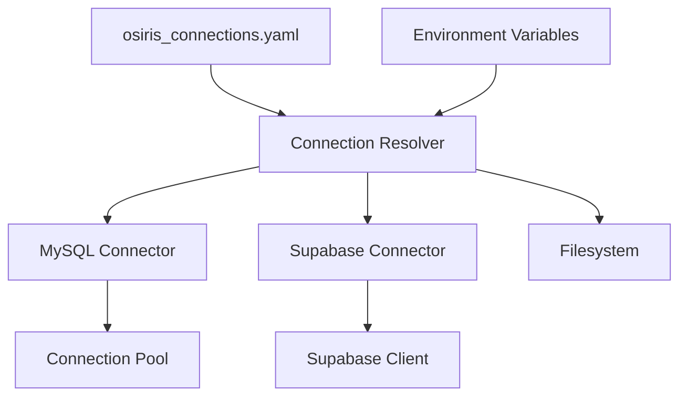

# Connectors Module Documentation

## Overview
The Connectors module (`osiris/connectors/`) provides database-specific connection management and utilities for various data sources.

## Module Structure
```
osiris/connectors/
├── mysql/
│   ├── connection.py      # MySQL connection management
│   └── utils.py           # MySQL-specific utilities
├── supabase/
│   ├── connection.py      # Supabase client management
│   └── utils.py           # Supabase utilities
└── filesystem/
    └── utils.py           # File system utilities
```

## Connection Architecture



## MySQL Connector

### connection.py - MySQL Connection Management

**Key Classes:**
```python
class MySQLConnection:
    """MySQL connection with pooling support."""

    def __init__(self, config: dict):
        self.config = config
        self.engine = None
        self._init_engine()

    def _init_engine(self):
        """Initialize SQLAlchemy engine with connection pool."""
        from sqlalchemy import create_engine
        from sqlalchemy.pool import QueuePool

        connection_url = self._build_url()
        self.engine = create_engine(
            connection_url,
            poolclass=QueuePool,
            pool_size=5,
            max_overflow=10,
            pool_recycle=3600  # Recycle connections after 1 hour
        )

    def execute_query(self, query: str, timeout: int = 30) -> pd.DataFrame:
        """Execute query and return DataFrame."""
        with self.engine.connect() as conn:
            return pd.read_sql(query, conn, timeout=timeout)
```

**Connection Configuration:**
```yaml
# osiris_connections.yaml
connections:
  mysql:
    default:
      host: ${MYSQL_HOST:-localhost}
      port: ${MYSQL_PORT:-3306}
      database: ${MYSQL_DATABASE}
      username: ${MYSQL_USER:-root}
      password: ${MYSQL_PASSWORD}
      # Optional parameters
      charset: utf8mb4
      connect_timeout: 10
      read_timeout: 30
```

### utils.py - MySQL Utilities

**Query Validation:**
```python
def validate_read_only(query: str) -> bool:
    """Validate query is read-only."""
    FORBIDDEN = [
        'INSERT', 'UPDATE', 'DELETE', 'DROP',
        'CREATE', 'ALTER', 'TRUNCATE', 'GRANT'
    ]
    query_upper = query.upper()
    for op in FORBIDDEN:
        if re.search(rf'\b{op}\b', query_upper):
            raise ValueError(f"Operation {op} not allowed")
    return True
```

**Connection Testing:**
```python
def test_connection(config: dict) -> dict:
    """Test MySQL connectivity."""
    try:
        conn = MySQLConnection(config)
        result = conn.execute_query("SELECT 1 as test")
        return {
            "status": "connected",
            "version": conn.get_version(),
            "database": config["database"]
        }
    except Exception as e:
        return {
            "status": "failed",
            "error": str(e)
        }
```

## Supabase Connector

### connection.py - Supabase Client Management

**Key Classes:**
```python
class SupabaseConnection:
    """Supabase client wrapper."""

    def __init__(self, config: dict):
        from supabase import create_client

        self.url = config["url"]
        self.key = config["key"]
        self.client = create_client(self.url, self.key)

    def select(self, table: str, columns: str = "*",
               filters: dict = None) -> List[dict]:
        """Select data from table."""
        query = self.client.table(table).select(columns)

        if filters:
            for key, value in filters.items():
                query = query.eq(key, value)

        response = query.execute()
        return response.data

    def insert(self, table: str, data: List[dict]) -> dict:
        """Insert data into table."""
        response = self.client.table(table).insert(data).execute()
        return {"inserted": len(response.data)}

    def upsert(self, table: str, data: List[dict],
               on_conflict: str = None) -> dict:
        """Upsert data with conflict resolution."""
        query = self.client.table(table).upsert(data)
        if on_conflict:
            query = query.on_conflict(on_conflict)
        response = query.execute()
        return {"upserted": len(response.data)}
```

**Connection Configuration:**
```yaml
# osiris_connections.yaml
connections:
  supabase:
    main:
      url: ${SUPABASE_URL}
      key: ${SUPABASE_SERVICE_ROLE_KEY}
      # Optional parameters
      timeout: 30
      auto_refresh_token: true
```

### utils.py - Supabase Utilities

**Batch Processing:**
```python
def batch_insert(connection: SupabaseConnection,
                 table: str,
                 data: pd.DataFrame,
                 batch_size: int = 500):
    """Insert data in batches."""
    records = data.to_dict('records')

    for i in range(0, len(records), batch_size):
        batch = records[i:i+batch_size]
        connection.insert(table, batch)
        yield {"batch": i // batch_size, "rows": len(batch)}
```

**Table Introspection:**
```python
def get_table_schema(connection: SupabaseConnection,
                     table: str) -> dict:
    """Get table schema information."""
    # Query information_schema
    query = f"""
    SELECT column_name, data_type, is_nullable
    FROM information_schema.columns
    WHERE table_name = '{table}'
    """

    result = connection.client.rpc('sql', {'query': query}).execute()
    return {
        "table": table,
        "columns": result.data
    }
```

## Filesystem Connector

### utils.py - File System Utilities

**Path Management:**
```python
def ensure_directory(path: Path) -> Path:
    """Ensure directory exists."""
    path = Path(path)
    path.mkdir(parents=True, exist_ok=True)
    return path

def atomic_write(path: Path, content: bytes):
    """Write file atomically using temp file."""
    temp_path = path.with_suffix('.tmp')
    try:
        temp_path.write_bytes(content)
        temp_path.replace(path)
    except Exception:
        if temp_path.exists():
            temp_path.unlink()
        raise
```

**CSV Writing:**
```python
def write_csv_deterministic(df: pd.DataFrame,
                           path: Path,
                           **kwargs) -> None:
    """Write CSV with deterministic output."""
    # Sort columns for reproducibility
    df = df[sorted(df.columns)]

    # Default parameters
    params = {
        'index': False,
        'encoding': 'utf-8',
        'line_terminator': '\n',
        'date_format': '%Y-%m-%d %H:%M:%S'
    }
    params.update(kwargs)

    df.to_csv(path, **params)
```

## Connection Resolution

### Resolver Pattern

```python
class ConnectionResolver:
    """Resolve connection references to configurations."""

    def __init__(self, connections_file: str = "osiris_connections.yaml"):
        self.connections = self._load_connections(connections_file)

    def resolve(self, reference: str) -> dict:
        """Resolve @family.alias to configuration."""
        if not reference.startswith("@"):
            raise ValueError(f"Invalid reference: {reference}")

        family, alias = reference[1:].split(".")

        if family not in self.connections:
            raise KeyError(f"Unknown connection family: {family}")

        if alias not in self.connections[family]:
            raise KeyError(f"Unknown alias: {alias} in {family}")

        config = self.connections[family][alias]
        return self._resolve_environment(config)

    def _resolve_environment(self, config: dict) -> dict:
        """Resolve environment variables in config."""
        resolved = {}
        for key, value in config.items():
            if isinstance(value, str) and value.startswith("${"):
                # Parse ${VAR_NAME:-default}
                var_expr = value[2:-1]
                if ":-" in var_expr:
                    var_name, default = var_expr.split(":-", 1)
                    resolved[key] = os.environ.get(var_name, default)
                else:
                    resolved[key] = os.environ.get(var_expr, "")
            else:
                resolved[key] = value
        return resolved
```

## Connection Pooling

### MySQL Pool Management

```python
class ConnectionPool:
    """Manage database connection pools."""

    def __init__(self, max_connections: int = 10):
        self.pools = {}
        self.max_connections = max_connections

    def get_connection(self, config: dict) -> Connection:
        """Get connection from pool."""
        key = self._config_key(config)

        if key not in self.pools:
            self.pools[key] = self._create_pool(config)

        return self.pools[key].get_connection()

    def _create_pool(self, config: dict) -> Pool:
        """Create new connection pool."""
        return create_engine(
            self._build_url(config),
            pool_size=5,
            max_overflow=self.max_connections - 5,
            pool_recycle=3600,
            pool_pre_ping=True  # Verify connections
        )

    def close_all(self):
        """Close all connection pools."""
        for pool in self.pools.values():
            pool.dispose()
        self.pools.clear()
```

## Error Handling

### Connection Errors

```python
def handle_connection_error(e: Exception, config: dict) -> None:
    """Provide helpful error messages for connection failures."""

    if "Access denied" in str(e):
        raise ConnectionError(
            f"Access denied for user {config.get('username')}. "
            "Check username and password."
        )

    elif "Unknown database" in str(e):
        raise ConnectionError(
            f"Database {config.get('database')} not found. "
            "Verify database exists and spelling is correct."
        )

    elif "Can't connect" in str(e) or "Connection refused" in str(e):
        raise ConnectionError(
            f"Cannot connect to {config.get('host')}:{config.get('port')}. "
            "Check host, port, and network connectivity."
        )

    else:
        raise ConnectionError(f"Connection failed: {e}")
```

## Testing Connections

### Connection Doctor

```python
class ConnectionDoctor:
    """Diagnose connection issues."""

    def check_all(self) -> dict:
        """Check all configured connections."""
        results = {}
        resolver = ConnectionResolver()

        for family in resolver.connections:
            for alias in resolver.connections[family]:
                ref = f"@{family}.{alias}"
                results[ref] = self.check_connection(ref)

        return results

    def check_connection(self, reference: str) -> dict:
        """Check single connection."""
        try:
            config = ConnectionResolver().resolve(reference)
            family = reference.split(".")[0][1:]

            if family == "mysql":
                return test_mysql_connection(config)
            elif family == "supabase":
                return test_supabase_connection(config)
            else:
                return {"status": "unknown", "family": family}

        except Exception as e:
            return {
                "status": "error",
                "error": str(e)
            }
```

## Security Considerations

### Secret Handling

```python
def mask_connection_config(config: dict) -> dict:
    """Mask sensitive fields in connection config."""
    SENSITIVE_FIELDS = ['password', 'key', 'token', 'secret']
    masked = config.copy()

    for field in SENSITIVE_FIELDS:
        if field in masked:
            masked[field] = "***MASKED***"

    return masked
```

### SSL/TLS Support

```python
def configure_ssl(config: dict) -> dict:
    """Configure SSL for secure connections."""
    if config.get("require_ssl", False):
        config["ssl"] = {
            "ca": config.get("ssl_ca", "/etc/ssl/certs/ca-certificates.crt"),
            "verify_cert": True,
            "verify_identity": True
        }
    return config
```

## Best Practices

1. **Use connection pooling** - Reuse connections for performance
2. **Handle timeouts** - Set appropriate query timeouts
3. **Validate connections** - Test before heavy operations
4. **Mask secrets** - Never log passwords or keys
5. **Use transactions** - Ensure data consistency for writes
6. **Close connections** - Clean up resources properly
7. **Retry transient failures** - Handle network hiccups

## Future Enhancements

- PostgreSQL native connector
- MongoDB connector
- Redis connector for caching
- BigQuery connector
- Snowflake connector
- Connection health monitoring
- Automatic failover for replicas
