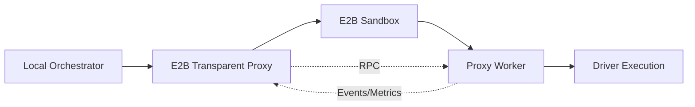

# Remote Module Documentation (E2B Integration)

## Overview
The Remote module (`osiris/remote/`) provides cloud execution capabilities through E2B (Ephemeral Build) sandboxes with transparent proxy architecture.

## Module Structure
```
osiris/remote/
├── e2b_transparent_proxy.py  # Main proxy adapter
├── proxy_worker.py           # Worker running in sandbox
├── rpc_protocol.py           # Communication protocol
└── e2b_client.py             # E2B SDK wrapper
```

## Architecture Overview



## Key Components

### e2b_transparent_proxy.py - Transparent Proxy Adapter

The main adapter implementing the ExecutionAdapter interface for E2B execution.

**Key Classes:**
```python
class E2BTransparentProxy(ExecutionAdapter):
    """Transparent proxy for E2B sandbox execution."""

    def prepare(self, manifest: dict, context: ExecutionContext) -> PreparedRun:
        """Prepare execution package for sandbox."""

    def execute(self, prepared: PreparedRun, context: ExecutionContext):
        """Execute pipeline in E2B sandbox."""

    def collect(self, prepared: PreparedRun, context: ExecutionContext) -> dict:
        """Collect artifacts from sandbox."""
```

**Key Features:**
- Sandbox lifecycle management
- Automatic dependency installation
- Real-time event streaming
- Artifact synchronization
- Heartbeat monitoring

**Configuration Options:**
```python
{
    "api_key": "e2b_...",        # E2B API key
    "template": "base",          # Sandbox template
    "cpu": 2,                    # CPU cores
    "memory_gb": 4,              # RAM in GB
    "timeout": 300,              # Timeout in seconds
    "install_deps": True,        # Auto-install Python packages
    "pass_env": ["VAR1", "VAR2"] # Environment variables to pass
}
```

### proxy_worker.py - Sandbox Worker

Runs inside the E2B sandbox to execute pipeline steps.

**Key Classes:**
```python
class ProxyWorker:
    """Worker process for E2B sandbox execution."""

    def run(self):
        """Main worker loop."""

    def handle_rpc(self, request: dict) -> dict:
        """Process RPC requests from proxy."""

    def execute_step(self, step: dict):
        """Execute a single pipeline step."""
```

**Responsibilities:**
- Receive execution packages via RPC
- Load and execute drivers
- Stream events and metrics back
- Handle dependency installation
- Manage working directory

### rpc_protocol.py - Communication Protocol

Defines the RPC protocol between proxy and worker.

**Message Types:**

```python
# Request from Proxy to Worker
{
    "id": "req_123",
    "method": "execute_step",
    "params": {
        "step_id": "extract_data",
        "driver": "mysql.extractor",
        "config": {...},
        "inputs": {...}
    }
}

# Response from Worker to Proxy
{
    "id": "req_123",
    "result": {
        "status": "success",
        "outputs": {"df": "..."},
        "metrics": {"rows_read": 100}
    }
}

# Event from Worker to Proxy
{
    "type": "event",
    "data": {
        "event": "step_complete",
        "step_id": "extract_data",
        "duration_ms": 250
    }
}
```

**Protocol Features:**
- Request-response pattern
- Async event streaming
- Heartbeat mechanism
- Error propagation
- Binary data transfer (for DataFrames)

### e2b_client.py - E2B SDK Wrapper

Wraps the E2B Python SDK with Osiris-specific functionality.

**Key Functions:**
```python
class E2BClient:
    def create_sandbox(self, config: dict) -> Sandbox:
        """Create new E2B sandbox."""

    def upload_package(self, sandbox: Sandbox, package: bytes):
        """Upload execution package to sandbox."""

    def execute_command(self, sandbox: Sandbox, command: str) -> str:
        """Execute command in sandbox."""

    def download_artifacts(self, sandbox: Sandbox, path: str) -> bytes:
        """Download artifacts from sandbox."""
```

## E2B Execution Flow

### 1. Preparation Phase
```python
def prepare(self, manifest: dict, context: ExecutionContext) -> PreparedRun:
    # Create execution package
    package = {
        "manifest": manifest,
        "connections": self._resolve_connections(),
        "environment": self._filter_environment()
    }

    # Serialize package
    prepared = PreparedRun(
        package=json.dumps(package),
        sandbox_config=self._build_sandbox_config()
    )

    return prepared
```

### 2. Execution Phase
```python
def execute(self, prepared: PreparedRun, context: ExecutionContext):
    # Create sandbox
    sandbox = self.client.create_sandbox(prepared.sandbox_config)

    # Upload package and worker
    self.client.upload_package(sandbox, prepared.package)
    self.client.upload_worker(sandbox)

    # Start worker process
    worker_process = sandbox.process.start("python proxy_worker.py")

    # Stream events back to context
    for event in self._stream_events(worker_process):
        context.log_event(event["type"], event["data"])
```

### 3. Collection Phase
```python
def collect(self, prepared: PreparedRun, context: ExecutionContext) -> dict:
    # Download artifacts
    artifacts = self.client.download_artifacts(
        sandbox,
        "/tmp/osiris/artifacts"
    )

    # Extract to local artifacts directory
    self._extract_artifacts(artifacts, context.artifacts_dir)

    # Cleanup sandbox
    sandbox.kill()

    return {"status": "success", "artifacts": list(artifacts)}
```

## Performance Characteristics

### Overhead Analysis
```
Sandbox Creation: ~820ms (one-time)
Package Upload: ~50ms
Worker Start: ~150ms
Per-Step RPC: <10ms
Artifact Download: 50-200ms (size dependent)
Total Overhead: <1% for typical pipelines
```

### Optimization Strategies

1. **Sandbox Reuse** (Future)
   - Keep sandboxes warm for multiple runs
   - Amortize creation cost

2. **Dependency Caching**
   - Pre-install common packages in template
   - Cache installed packages between runs

3. **Parallel Execution**
   - Execute independent steps concurrently
   - Use multiple sandboxes for parallelism

## Security Considerations

### Isolation
- Each pipeline runs in isolated sandbox
- No cross-contamination between runs
- Limited network access by default

### Secret Management
```python
# Secrets are filtered before sandbox upload
def _filter_secrets(self, config: dict) -> dict:
    """Remove secrets from configuration."""
    filtered = copy.deepcopy(config)
    for key in SENSITIVE_KEYS:
        if key in filtered:
            filtered[key] = "***MASKED***"
    return filtered
```

### Environment Variables
```python
# Only explicitly allowed variables are passed
def _filter_environment(self) -> dict:
    allowed = self.config.get("pass_env", [])
    return {
        key: os.environ[key]
        for key in allowed
        if key in os.environ
    }
```

## Error Handling

### Sandbox Failures
```python
try:
    sandbox = self.client.create_sandbox(config)
except E2BError as e:
    if "quota" in str(e):
        raise QuotaExceededError("E2B quota exceeded")
    elif "timeout" in str(e):
        raise TimeoutError("Sandbox creation timeout")
    else:
        raise SandboxError(f"Failed to create sandbox: {e}")
```

### Worker Crashes
```python
def monitor_worker(self, process):
    """Monitor worker process health."""
    while process.running:
        if not self._check_heartbeat():
            raise WorkerCrashError("Worker heartbeat lost")
        time.sleep(1)
```

## Testing E2B Integration

### Mock Sandbox Testing
```python
class MockSandbox:
    """Mock E2B sandbox for testing."""

    def __init__(self):
        self.files = {}
        self.processes = []

    def upload(self, path: str, content: bytes):
        self.files[path] = content

    def process_start(self, command: str):
        return MockProcess(command)
```

### Integration Tests
```python
@pytest.mark.e2b
def test_e2b_execution():
    # Requires E2B_API_KEY environment variable
    proxy = E2BTransparentProxy()
    manifest = load_test_manifest()
    context = create_test_context()

    prepared = proxy.prepare(manifest, context)
    proxy.execute(prepared, context)
    results = proxy.collect(prepared, context)

    assert results["status"] == "success"
    assert Path(context.artifacts_dir).exists()
```

## CLI Integration

### E2B-Specific Flags
```bash
# Basic E2B execution
osiris run pipeline.yaml --e2b

# With configuration
osiris run pipeline.yaml \
    --e2b \
    --e2b-cpu 4 \
    --e2b-mem 8 \
    --e2b-timeout 600 \
    --e2b-install-deps

# Pass environment variables
osiris run pipeline.yaml \
    --e2b \
    --e2b-env KEY1=value1 \
    --e2b-pass-env KEY2
```

## Monitoring and Debugging

### Event Stream
```json
{
  "event": "sandbox_created",
  "sandbox_id": "sb_abc123",
  "template": "base",
  "duration_ms": 823
}

{
  "event": "worker_started",
  "pid": 1234,
  "python_version": "3.11.0"
}

{
  "event": "dependency_installed",
  "package": "pandas==2.0.0",
  "duration_ms": 1250
}
```

### Debug Mode
```python
# Enable debug logging
os.environ["E2B_DEBUG"] = "true"

# Verbose RPC logging
os.environ["OSIRIS_RPC_DEBUG"] = "true"
```

## Best Practices

1. **Minimize package size** - Only upload necessary files
2. **Use templates** - Pre-configured sandboxes for common scenarios
3. **Handle timeouts** - Set appropriate timeouts for long operations
4. **Monitor resources** - Track CPU/memory usage in sandbox
5. **Cleanup properly** - Always kill sandboxes after use
6. **Test locally first** - Verify pipeline works before E2B
7. **Cache dependencies** - Use templates with pre-installed packages

## Future Enhancements

- Sandbox pooling for faster startup
- GPU support for ML workloads
- Custom Docker images
- Distributed execution across multiple sandboxes
- Cost optimization with spot instances
