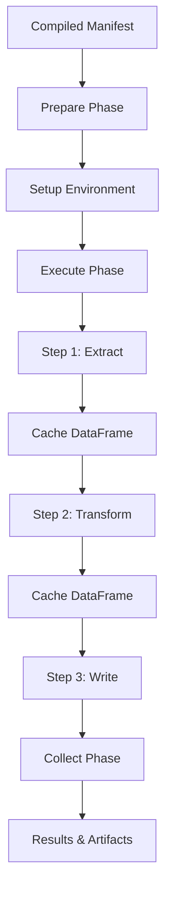

# Runtime Module Documentation

## Overview
The Runtime module (`osiris/runtime/`) provides local execution capabilities for Osiris pipelines using native Python drivers.

## Module Structure
```
osiris/runtime/
└── local_adapter.py  # Local execution adapter
```

## Key Components

### local_adapter.py - Local Execution Adapter

Implements the ExecutionAdapter interface for local pipeline execution.

**Key Class:**
```python
class LocalAdapter(ExecutionAdapter):
    """Execute pipelines locally using registered drivers."""

    def prepare(self, manifest: dict, context: ExecutionContext) -> PreparedRun:
        """Prepare local execution environment."""

    def execute(self, prepared: PreparedRun, context: ExecutionContext):
        """Execute pipeline steps sequentially."""

    def collect(self, prepared: PreparedRun, context: ExecutionContext) -> dict:
        """Collect local execution results."""
```

## Local Execution Architecture



## Implementation Details

### Preparation Phase

```python
def prepare(self, manifest: dict, context: ExecutionContext) -> PreparedRun:
    """Prepare for local execution."""
    # Validate manifest structure
    self._validate_manifest(manifest)

    # Initialize driver registry
    self._init_drivers()

    # Setup working directory
    working_dir = context.artifacts_dir / "working"
    working_dir.mkdir(exist_ok=True)

    # Create execution plan
    plan = {
        "manifest": manifest,
        "working_dir": str(working_dir),
        "data_cache": {},  # For DataFrame passing
        "drivers": self._get_required_drivers(manifest)
    }

    return PreparedRun(
        run_id=context.session_id,
        package=plan,
        metadata={"adapter": "local"}
    )
```

### Execution Phase

```python
def execute(self, prepared: PreparedRun, context: ExecutionContext):
    """Execute pipeline steps."""
    plan = prepared.package
    manifest = plan["manifest"]
    data_cache = plan["data_cache"]

    for step in manifest["steps"]:
        try:
            # Log step start
            context.log_event("step_start", {
                "step_id": step["id"],
                "driver": step["driver"]
            })

            # Get driver
            driver = DriverRegistry.get(step["driver"])

            # Prepare inputs from cache
            inputs = self._prepare_inputs(step, data_cache)

            # Execute step
            start_time = time.time()
            outputs = driver.run(
                step_id=step["id"],
                config=step["config"],
                inputs=inputs,
                ctx=context
            )
            duration_ms = (time.time() - start_time) * 1000

            # Cache outputs for downstream steps
            if outputs and "df" in outputs:
                data_cache[step["id"]] = outputs["df"]

            # Log completion
            context.log_event("step_complete", {
                "step_id": step["id"],
                "duration_ms": duration_ms,
                "rows_processed": len(outputs.get("df", []))
            })

        except Exception as e:
            # Log failure
            context.log_event("step_failed", {
                "step_id": step["id"],
                "error": str(e),
                "traceback": traceback.format_exc()
            })
            raise
```

### Collection Phase

```python
def collect(self, prepared: PreparedRun, context: ExecutionContext) -> dict:
    """Collect execution results."""
    # Gather metrics
    total_rows = sum(
        m["value"]
        for m in context.metrics
        if m["metric"] in ["rows_read", "rows_written"]
    )

    # Count completed steps
    completed = len([
        e for e in context.events
        if e["event"] == "step_complete"
    ])

    # Build result
    result = {
        "status": "success",
        "steps_completed": completed,
        "total_rows": total_rows,
        "artifacts": list(context.artifacts_dir.iterdir())
    }

    # Log cleanup
    context.log_event("cleanup_complete", {
        "total_rows": total_rows,
        "duration_ms": self._get_total_duration()
    })

    return result
```

## DataFrame Management

### In-Memory Cache

The LocalAdapter maintains an in-memory cache for passing DataFrames between steps:

```python
class DataFrameCache:
    """Cache for DataFrame passing between steps."""

    def __init__(self):
        self._cache = {}

    def put(self, step_id: str, df: pd.DataFrame):
        """Store DataFrame output from step."""
        self._cache[step_id] = df

    def get(self, step_id: str) -> pd.DataFrame:
        """Retrieve DataFrame for input."""
        return self._cache.get(step_id)

    def clear(self):
        """Clear cache to free memory."""
        self._cache.clear()
```

### Input Resolution

```python
def _prepare_inputs(self, step: dict, cache: dict) -> dict:
    """Resolve input references from cache."""
    inputs = {}

    for key, ref in step.get("inputs", {}).items():
        if ref.startswith("${") and ref.endswith("}"):
            # Parse reference: ${step_id.output_key}
            ref_parts = ref[2:-1].split(".")
            step_id = ref_parts[0]
            output_key = ref_parts[1] if len(ref_parts) > 1 else "df"

            # Get from cache
            if step_id in cache:
                inputs[key] = cache[step_id]
            else:
                raise ValueError(f"Step {step_id} output not found")
        else:
            # Direct value
            inputs[key] = ref

    return inputs
```

## Driver Management

### Registry Initialization

```python
def _init_drivers(self):
    """Initialize driver registry."""
    # Import all driver modules to trigger registration
    from osiris.drivers import (
        mysql_extractor_driver,
        mysql_writer_driver,
        filesystem_csv_writer_driver,
        supabase_extractor_driver,
        supabase_writer_driver
    )

    # Verify required drivers are registered
    registered = DriverRegistry.list_drivers()
    logger.info(f"Registered drivers: {registered}")
```

### Driver Validation

```python
def _validate_driver_availability(self, manifest: dict):
    """Ensure all required drivers are available."""
    required = set()
    for step in manifest["steps"]:
        required.add(step["driver"])

    available = set(DriverRegistry.list_drivers())
    missing = required - available

    if missing:
        raise RuntimeError(
            f"Missing drivers: {missing}. "
            f"Available: {available}"
        )
```

## Connection Resolution

### Local Connection Loading

```python
def _resolve_connections(self, config: dict) -> dict:
    """Resolve connection references for local execution."""
    if "connection" in config and config["connection"].startswith("@"):
        # Parse reference: @family.alias
        family, alias = config["connection"][1:].split(".")

        # Load from osiris_connections.yaml
        connections = self._load_connections_file()

        if family in connections and alias in connections[family]:
            connection = connections[family][alias]

            # Resolve environment variables
            resolved = {}
            for key, value in connection.items():
                if isinstance(value, str) and value.startswith("${"):
                    env_var = value[2:-1].split(":")[0]
                    resolved[key] = os.environ.get(env_var, "")
                else:
                    resolved[key] = value

            config["resolved_connection"] = resolved

    return config
```

## Error Handling

### Graceful Failure

```python
def execute(self, prepared: PreparedRun, context: ExecutionContext):
    """Execute with proper error handling."""
    try:
        self._execute_steps(prepared, context)

    except KeyboardInterrupt:
        context.log_event("execution_interrupted", {})
        raise

    except Exception as e:
        context.log_event("execution_failed", {
            "error": str(e),
            "type": type(e).__name__
        })
        raise

    finally:
        # Always cleanup
        self._cleanup_resources(prepared)
```

### Resource Cleanup

```python
def _cleanup_resources(self, prepared: PreparedRun):
    """Clean up resources after execution."""
    # Clear DataFrame cache
    if "data_cache" in prepared.package:
        prepared.package["data_cache"].clear()

    # Close database connections
    for driver in self._active_drivers:
        if hasattr(driver, "close"):
            driver.close()

    # Remove temporary files
    temp_dir = Path(prepared.package.get("working_dir", ""))
    if temp_dir.exists():
        shutil.rmtree(temp_dir, ignore_errors=True)
```

## Performance Considerations

### Memory Management

```python
# Clear cache after large operations
if df.memory_usage().sum() > 100_000_000:  # 100MB
    logger.warning("Large DataFrame detected, clearing old cache entries")
    self._evict_old_cache_entries()
```

### Sequential vs Parallel

Currently, LocalAdapter executes steps sequentially. Future enhancements for parallel execution:

```python
# Future: Parallel execution for independent steps
def _identify_parallel_groups(self, manifest: dict) -> List[List[str]]:
    """Identify steps that can run in parallel."""
    # Build dependency graph
    # Find independent groups
    # Return execution groups
    pass
```

## Testing LocalAdapter

### Unit Tests

```python
def test_local_execution():
    adapter = LocalAdapter()
    manifest = {
        "version": "1.0.0",
        "steps": [
            {
                "id": "test_step",
                "driver": "test.driver",
                "config": {"test": True}
            }
        ]
    }

    context = MockExecutionContext()
    prepared = adapter.prepare(manifest, context)
    adapter.execute(prepared, context)
    results = adapter.collect(prepared, context)

    assert results["status"] == "success"
    assert results["steps_completed"] == 1
```

### Integration Tests

```python
def test_end_to_end_local():
    # Load real manifest
    manifest = load_manifest("test_pipeline.yaml")

    # Create real context
    context = ExecutionContext(
        session_id="test_run",
        artifacts_dir=Path("/tmp/test")
    )

    # Execute locally
    adapter = LocalAdapter()
    prepared = adapter.prepare(manifest, context)
    adapter.execute(prepared, context)
    results = adapter.collect(prepared, context)

    # Verify outputs
    assert Path("/tmp/test/output.csv").exists()
```

## Comparison with E2B

| Feature | LocalAdapter | E2BTransparentProxy |
|---------|--------------|---------------------|
| Execution Location | Local machine | Cloud sandbox |
| Isolation | Process-level | Container-level |
| Dependencies | Must be pre-installed | Auto-installed |
| Performance | Direct execution | ~1% RPC overhead |
| Resource Limits | Local machine limits | Configurable |
| Debugging | Direct access | Via logs/artifacts |

## Best Practices

1. **Validate early** - Check drivers and connections before execution
2. **Clean up always** - Use try/finally for resource cleanup
3. **Cache wisely** - Balance memory usage with performance
4. **Log everything** - Emit detailed events for debugging
5. **Handle interrupts** - Graceful shutdown on Ctrl+C
6. **Test thoroughly** - Unit and integration tests

## Future Enhancements

- Parallel step execution for DAGs
- Streaming DataFrame support
- Checkpoint/resume capability
- Resource monitoring and limits
- Plugin system for custom drivers
