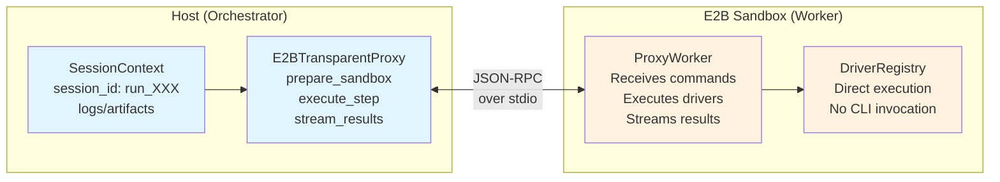

# Milestone M1f - E2B Transparent Proxy

## Context

Per ADR-0026, we are replacing the nested session architecture with a transparent proxy model. The current E2B implementation creates a "session within a session" by running `osiris run` inside the sandbox, leading to:

- **Nested sessions**: Outer orchestration session + inner execution session
- **Artifact location mismatch**: `remote/session/artifacts/` vs `artifacts/`
- **Double row counting**: Both sessions count rows (84 local -> 168 E2B)
- **Split logging**: Different log levels and locations
- **Metadata inconsistency**: Pipeline info split between sessions

## Goals

1. **Execution Parity**: Identical structure for local and E2B runs
2. **Unified Session**: Single session ID throughout execution
3. **Consistent Paths**: Same artifact locations regardless of runtime
4. **Streaming Support**: Real-time event and metric propagation
5. **Secure Secrets**: Proper handling without exposure in logs

## Research Findings

### E2B SDK Capabilities

Based on research using Context7 MCP and web search:

#### 1. **AsyncSandbox (Beta) - Selected for Implementation**
- **Async Operations**: Full async/await support for all operations
- **Streaming Methods**:
  ```python
  # AsyncSandbox specific methods we'll use:
  async_sandbox = await AsyncSandbox.create()
  
  # Stream command output
  await async_sandbox.commands.run(
      "python script.py",
      on_stdout=lambda data: await stream_handler(data),
      on_stderr=lambda data: await error_handler(data)
  )
  
  # File operations
  await async_sandbox.filesystem.write(path, content)
  async for chunk in async_sandbox.filesystem.read_stream(path):
      await process_chunk(chunk)
  ```
- **Process Management**: `send_stdin()` for interactive communication
- **Lifecycle**: `await async_sandbox.close()` for cleanup

#### 2. **File Transfer**
- **Batch Operations**: Write multiple files atomically
- **Stream Reading**: AsyncIterator for memory-efficient transfers
- **Direct URLs**: HTTP endpoints for large file uploads/downloads
- **Metadata**: EntryInfo with size, type, modification time

#### 3. **Environment Management**
- **Environment Variables**: Pass secrets via `envs` parameter
- **Working Directory**: Set via `cwd` parameter
- **Persistent Sessions**: Reconnect to existing sandboxes by ID
- **Timeout Control**: Configurable execution timeouts

#### 4. **Performance Characteristics**
- Sandbox creation: ~150ms (acceptable, no pooling needed)
- Network latency: ~10-50ms per operation
- Streaming latency: < 100ms for stdout/stderr
- Maximum lifetime: 24h (Pro) / 1h (Hobby)

## Proposed Design

### Architecture Overview



### Alternative ASCII Diagram
```
┌─────────────────────────────┐     ┌─────────────────────────────┐
│   Host (Orchestrator)       │     │   E2B Sandbox (Worker)      │
├─────────────────────────────┤     ├─────────────────────────────┤
│                             │     │                             │
│  SessionContext             │     │  ProxyWorker                │
│  • session_id: run_XXX      │────▶│  • Receives commands        │
│  • logs/run_XXX/            │     │  • Executes drivers         │
│  • artifacts/               │◀────│  • Streams results          │
│                             │     │                             │
│  E2BTransparentProxy        │     │  No CLI invocation!         │
│  • prepare_sandbox()        │     │  Direct driver execution    │
│  • execute_step()           │────▶│  Same paths as host         │
│  • stream_results()         │◀────│  Events → host session      │
│                             │     │                             │
└─────────────────────────────┘     └─────────────────────────────┘
         JSON-RPC Protocol                 Streaming I/O
```

### Implementation Approach

#### Lightweight RPC Protocol

Define a simple command protocol over stdout/stdin:

```python
# Commands from host to sandbox
PREPARE = {"cmd": "prepare", "session_id": "run_XXX", "manifest": {...}}
EXEC_STEP = {"cmd": "exec_step", "step_id": "extract-actors", "config": {...}}
CLEANUP = {"cmd": "cleanup"}

# Responses from sandbox to host
READY = {"status": "ready", "session_id": "run_XXX"}
STEP_RESULT = {"status": "complete", "step_id": "extract-actors", "rows": 42}
EVENT = {"type": "event", "name": "step_start", "data": {...}}
METRIC = {"type": "metric", "name": "rows_read", "value": 42}
```

#### Proxy Worker Implementation

```python
# proxy_worker.py - Runs inside E2B sandbox
class ProxyWorker:
    def __init__(self):
        self.drivers = DriverRegistry()
        self.session_id = None
        self.session_dir = None
        
    async def handle_command(self, cmd):
        if cmd["cmd"] == "prepare":
            self.session_id = cmd["session_id"]
            self.session_dir = Path(f"/session/{self.session_id}")
            self.session_dir.mkdir(parents=True, exist_ok=True)
            
            # Set up logging to stream back
            setup_streaming_logger(self.stream_event)
            
            # Load drivers
            self.drivers.load_all()
            
            return {"status": "ready", "session_id": self.session_id}
            
        elif cmd["cmd"] == "exec_step":
            step_id = cmd["step_id"]
            config = cmd["config"]
            driver_name = cmd["driver"]
            
            # Execute driver directly
            driver = self.drivers.get(driver_name)
            result = await driver.run(
                step_id=step_id,
                config=config,
                inputs=cmd.get("inputs"),
                ctx=self.create_context()
            )
            
            # Stream metrics
            self.stream_metric("rows_written", result.get("rows"))
            
            return {"status": "complete", "step_id": step_id, **result}
    
    def stream_event(self, event_name, **kwargs):
        """Stream event back to host."""
        print(json.dumps({
            "type": "event",
            "name": event_name,
            "data": kwargs
        }))
        
    def stream_metric(self, metric_name, value):
        """Stream metric back to host."""
        print(json.dumps({
            "type": "metric", 
            "name": metric_name,
            "value": value
        }))
```

#### Transparent Proxy Adapter

```python
# e2b_transparent_proxy.py - Runs on host
from e2b import AsyncSandbox  # Use async SDK

class E2BTransparentProxy(ExecutionAdapter):
    def __init__(self, config):
        self.sandbox = None
        self.worker_process = None
        
    async def execute(self, manifest_data, context):
        # Use EXISTING session from context
        session_id = context.session_id
        session_dir = context.session_dir
        
        # Create async sandbox with session mount
        self.sandbox = await AsyncSandbox.create(
            envs=self.prepare_env_vars(),
            # Mount host session dir into sandbox
            volumes={
                str(session_dir): "/session"
            }
        )
        
        # Upload proxy worker
        await self.sandbox.filesystem.write(
            "/workspace/proxy_worker.py",
            PROXY_WORKER_CODE
        )
        
        # Start proxy worker with async streaming
        self.worker_process = await self.sandbox.commands.run(
            "python /workspace/proxy_worker.py",
            background=True,
            on_stdout=lambda data: asyncio.create_task(
                self.handle_worker_output(data)
            ),
            on_stderr=lambda data: asyncio.create_task(
                self.handle_worker_error(data)
            )
        )
        
        # Send prepare command
        await self.send_command({
            "cmd": "prepare",
            "session_id": session_id,
            "manifest": manifest_data
        })
        
        # Execute steps
        for step in manifest_data["steps"]:
            await self.send_command({
                "cmd": "exec_step",
                "step_id": step["id"],
                "driver": step["driver"],
                "config": self.resolve_config(step)
            })
            
        # Cleanup
        await self.send_command({"cmd": "cleanup"})
        await self.sandbox.close()
        
    async def handle_worker_output(self, data):
        """Process streamed output from worker."""
        try:
            msg = json.loads(data)
            
            if msg["type"] == "event":
                # Write directly to host session
                log_event(msg["name"], **msg["data"])
                
            elif msg["type"] == "metric":
                # Write directly to host session
                log_metric(msg["name"], msg["value"])
                
            elif msg["status"] == "complete":
                # Step completed
                self.handle_step_complete(msg)
                
        except json.JSONDecodeError:
            # Regular output
            logger.info(data)
```

### Key Design Decisions

#### 1. **No Nested CLI Execution**
- Sandbox runs a lightweight proxy worker, not full CLI
- Direct driver invocation without session creation
- All session management stays on host

#### 2. **Session Directory Mounting**
- Host session directory mounted as `/session` in sandbox
- Artifacts written directly to correct location
- No need for post-execution copying

#### 3. **Streaming via stdout/stdin**
- JSON-RPC style protocol over process pipes
- Real-time event and metric streaming
- No WebSocket complexity needed

#### 4. **Secrets Handling**
```python
def prepare_env_vars(self):
    """Prepare environment variables with proper masking."""
    env_vars = {}
    
    # Read from .env but don't log values
    for key, value in os.environ.items():
        if key.startswith("MYSQL_") or key.endswith("_KEY"):
            env_vars[key] = value  # Pass through
            logger.info(f"Setting {key}=***")  # Log masked
        else:
            env_vars[key] = value
            
    return env_vars
```

## Implementation Sprint (Single Phase with AI)

### Sprint Tasks (15 minutes with AI assistance)
- [ ] **Protocol Definition** (2 min): Define JSON-RPC messages
- [ ] **ProxyWorker Core** (3 min): Implement command handler with AI code generation
- [ ] **E2BTransparentProxy** (3 min): Create async adapter using AsyncSandbox
- [ ] **Integration** (2 min): Connect to ExecutionAdapter interface
- [ ] **Streaming Setup** (2 min): Wire up stdout/stderr callbacks
- [ ] **Testing** (2 min): Generate test cases with AI
- [ ] **Documentation** (1 min): Update ADR and user docs

### AI Prompts for Implementation
```
1. "Generate ProxyWorker class that handles JSON-RPC commands over stdin/stdout"
2. "Create E2BTransparentProxy using E2B AsyncSandbox with streaming callbacks"
3. "Write unit tests for RPC protocol handling and streaming"
4. "Generate integration test comparing local vs E2B session output"
```

## Testing Strategy

### Unit Tests
```python
async def test_proxy_worker_handles_prepare():
    worker = ProxyWorker()
    result = await worker.handle_command({
        "cmd": "prepare",
        "session_id": "test_123",
        "manifest": {...}
    })
    assert result["status"] == "ready"
    assert worker.session_id == "test_123"
```

### Integration Tests
```python
async def test_e2b_transparent_proxy_execution():
    proxy = E2BTransparentProxy(config)
    context = ExecutionContext(session_id="run_123")
    
    # Mock async sandbox
    with patch("e2b.AsyncSandbox") as mock_sandbox:
        await proxy.execute(manifest, context)
        
        # Verify no nested session created
        mock_sandbox.commands.run.assert_not_called_with(
            StringContaining("osiris run")
        )
```

### End-to-End Tests
- Run same pipeline locally and via E2B
- Compare:
  - Session structure
  - Event counts
  - Artifact locations
  - Row counts
  - Log content

## Risks and Mitigations

### Risk 1: AsyncSandbox Beta Status
**Issue**: Beta SDK may have undocumented behaviors  
**Mitigation**: 
- Fallback to sync SDK if critical issues found
- Comprehensive error handling and logging
- Regular SDK version updates

### Risk 2: Performance Overhead
**Issue**: Sandbox startup adds ~150ms latency  
**Mitigation**: 
- Accept 150ms as reasonable (per user feedback)
- No sandbox pooling needed (keep it simple)
- Focus on streaming efficiency instead

### Risk 3: Network Reliability
**Issue**: Connection drops during execution  
**Mitigation**:
- AsyncSandbox handles reconnection internally
- Checkpoint state between steps
- Implement timeout with retry logic

### Risk 4: Secret Exposure
**Issue**: Secrets may leak in logs or error messages  
**Mitigation**:
- Strict masking rules in proxy worker
- Separate secret injection from logging
- Audit all output paths before release

## Success Criteria

1. **Identical Output Structure**
   ```
   # Both local and E2B produce:
   logs/run_XXX/
   ├── events.jsonl      # Same event count
   ├── metrics.jsonl     # Same metrics
   ├── artifacts/        # Same location
   └── osiris.log        # Same log level
   ```

2. **Performance Targets**
   - Overhead: < 10% vs local execution
   - Startup: < 5 seconds including deps
   - Streaming latency: < 100ms

3. **Zero Data Loss**
   - All events captured
   - All metrics recorded
   - All artifacts preserved

4. **Security Requirements**
   - No secrets in logs
   - No credentials in artifacts
   - Encrypted transport

## Decision Points

### Q1: Streaming Implementation
**Options**:
1. stdout/stdin JSON-RPC (chosen)
2. WebSocket connection
3. File polling

**Decision**: JSON-RPC is simplest and sufficient

### Q2: SDK Selection
**Options**:
1. Sync SDK (stable)
2. AsyncSandbox Beta (chosen)
3. Custom WebSocket implementation

**Decision**: AsyncSandbox for better streaming support

### Q3: Error Handling
**Options**:
1. Fail fast
2. Retry with backoff (chosen)
3. Fallback to local

**Decision**: Retry to handle transient issues

## Next Steps

1. **Immediate Actions**
   - Generate ProxyWorker with AI assistance
   - Test AsyncSandbox streaming capabilities
   - Verify session mounting approach

2. **Validation**
   - Run proof-of-concept with simple pipeline
   - Compare outputs byte-for-byte
   - Measure performance overhead

3. **Release Planning**
   - Update ADR-0026 with implementation details
   - Create migration guide for users
   - Plan deprecation of nested session approach
