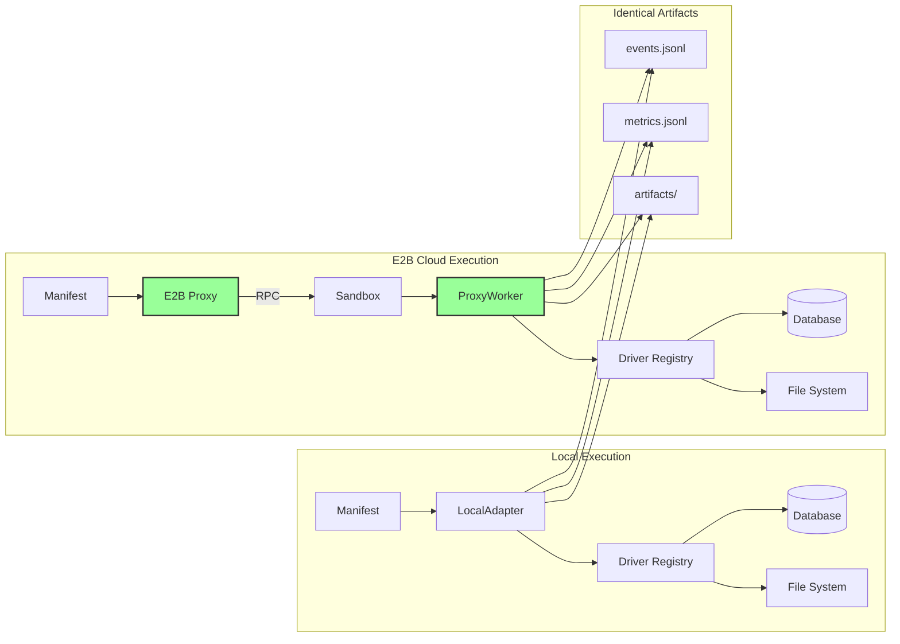

# Osiris: The Compiler for AI-Native Data Pipelines

## Executive Brief

---

## 1. Executive Summary

**The Problem**

Most data teams have become experts in tools rather than experts in the business. They tune Snowflake row‑level security, debate Data Vault modeling, and stitch together fragile integrations—while the real job is to understand customer behavior and improve outcomes. LLMs help, but code they generate is often non‑deterministic and hard to run safely at scale. The result: expensive stacks, fragile pipelines, and slow time‑to‑impact.

**Our Solution**

Tell Osiris your business problem. Osiris interrogates your data, asks clarifying questions, and synthesizes an OML (Osiris Markup Language) definition of a pipeline that addresses the problem. It then compiles OML into a deterministic manifest and runs it with complete parity across environments. Around that, Osiris provides AI management (so you don’t babysit a data stack) and deep observability (when you *do* want to see exactly what happened). Osiris is your transparent, AI‑native data stack that prioritizes your success over vendor revenue—and it’s open source under the Apache 2.0 license.

**Why This Matters**

Osiris turns data teams into outcome engines. By moving from hand‑assembled tooling to intent‑driven compilation, teams deliver value dramatically faster and with higher reliability.

**Tangible value for organizations**
- **10–100× faster from idea to production**: describe outcomes in plain language; compile to a deterministic pipeline the same day, not weeks later.
- **Far fewer incidents and rewrites**: strict validation and reproducible manifests prevent the “works on my machine” class of failures.
- **Democratized delivery**: analysts and domain experts can safely author pipelines; engineers focus on the tricky 10%, not repetitive scaffolding.
- **Lower total cost of ownership**: open‑source (Apache 2.0), vendor‑agnostic, and portable across environments.
- **Faster iteration loops**: structured events, HTML reports, and AI‑readable run bundles accelerate post‑mortems and continuous improvement.

**Bottom line**: Osiris is the reliable bridge between human intent and machine execution for AI‑native data work—think *infrastructure‑as‑code* for pipelines: declarative, reproducible, and portable. The goal isn’t flashier AI; it’s dependable AI that compounds impact across the business.

**Our Mission**

Make advanced data automation universally accessible. Turn every motivated person into a capable builder by providing a free, open, AI‑native compiler and runtime that translates plain‑language intent into reliable execution.

We will bring Osiris to everyone—open source under Apache 2.0—so people can learn and apply skills that matter to customers and society, not just ship tickets. Start with data pipelines, then expand to broader process automation.

**Positioning at a glance**

- Transparent by design: deterministic compiler + parity adapters; every step is explainable.
- Outcome‑first: start from business intent, not tool configuration.
- Vendor‑agnostic & OSS: Apache 2.0 core; run locally, in your cloud, or inside your orchestrator.
- Ops without toil: AI management handles discovery, scaffolding, and safe defaults.
- Deep observability: structured events, HTML reports, and AI‑readable bundles for post‑mortems.


---


### CEO Talk Track: 30s / 60s / 120s

**30 seconds** — TDB

**60 seconds** — TBD

**120 seconds** — TBD

- “Intent is conversational; execution is compiled.”
- “Parity adapters make infrastructure a choice, not a constraint.”
- “Every run is explainable to humans and actionable by AI.”
- “Determinism is the contract that makes AI safe for production.”

## 2. Key Capabilities of Osiris

### • **Conversational Pipeline Synthesis**

Describe outcomes in natural language; Osiris explores **any data source** (databases are just the start: files, object stores, APIs, message buses), asks clarifying questions, and synthesizes an OML (Osiris Markup Language) specification grounded in real discovery. It validates assumptions up front so what gets proposed is feasible before you ever hit “run”.

### • **Deterministic Compiler & Runtime**

OML compiles into a fingerprinted, deterministic manifest (same input → same output). Configs are validated against component specs, dependencies are resolved, and an execution plan is produced. **Anything that compiles is production ready**, auditable, reproducible, and safe to move from laptop to production without surprises.

### • **Transparent Execution Adapters**

Run the exact same manifest **anywhere** with full parity: locally, in E2B sandboxes today, and - on the roadmap - **Keboola, Kubernetes/OpenShift**, and **enterprise schedulers**. Change infrastructure, not pipeline code; logs, metrics, and artifacts remain identical.

### • **Comprehensive Observability**

Every run emits structured events, metrics, and artifacts and produces an interactive HTML report for deep debugging. Osiris also packages an **AI ready Run Context Bundle** (including an **ad-hoc memory** of the run) so assistants can perform post-mortems, root-cause analysis, and “AI SRE” investigations on demand—turning operations into a continuous learning loop.

### • **Self-Describing Component Registry**

Components declare capabilities and configuration via JSON Schema, enabling automatic validation, secret masking, and rich LLM context. Adding a new component is intentionally **simple**. Planned compatibility includes **Keboola connectors, Airbyte connectors, Singer Taps & Targets, Boomi OSS connectors, Mage.ai** connectors, and more—so teams can reuse what they already know.

### • **Persistent Memory System** *(Planned)*

Osiris acts as **connected organizational consciousness**: it remembers discovered schemas, successful patterns, domain definitions, and prior fixes. Memory spans personal, team, and org scopes, and is designed to integrate with Git so knowledge is portable, reviewable, and kept fresh.

### • **Production Scheduling & Lineage** *(Milestone M2)*

A **modern scheduler** with ownership, approvals, SLAs, and first-class lineage. Osiris provides native integration with existing orchestrators (Airflow, Prefect, etc.) for gradual adoption without rewiring the shop.

### • **Streaming & Parallel Execution** *(Milestone M3)*

Native streaming I/O (Kafka, Kinesis, and beyond), chunked processing for unbounded datasets, and fan-out/fan-in patterns for parallelism. Deep telemetry (OpenTelemetry/Datadog) ensures scale without losing insight.

### • **Iceberg Tables & DWH Agent** *(Milestone M4)*

Direct writes to **Apache Iceberg** for ACID + time travel. An intelligent **DWH Agent** manages schemas, partitions, and cost controls, **persists results from Osiris pipelines**, and **serves those datasets back** into new pipelines and **AI agent workloads** - closing the loop from creation to consumption.

---

## 3. How Osiris Works (Technical Walkthrough)

### Step-by-Step Process

**1. Interactive Chat Generates OML**

Start with `osiris chat` and describe an outcome, not a tool config - e.g., “*Identify customers inactive for 90 days and prepare a re-activation campaign*.” 

The Osiris Agent already knows which **connectors** are available, where it can connect, and the **full capability context** you currently have (sources, destinations, auth, limits). It interrogates the relevant systems, asks clarifying questions, and synthesizes an **OML** (Osiris Markup Language) specification grounded in what’s actually possible in your environment.

**2. OML Validation and Compilation**

Compilation turns AI-generated intent into a **deterministic, production-ready artifact**. The compiler validates the OML (required fields, forbidden keys, schema compliance), resolves dependencies, and produces an **execution plan for the runner** while verifying that every referenced component can work as specified. The output is a **compiled manifest** (fingerprinted, reproducible) — the artifact you version-control in your repo as the source of truth for production pipelines.

**3. Execution via Adapters**

`osiris run` executes the compiled manifest with **full parity** across environments (local, E2B today; Keboola, Kubernetes/OpenShift, enterprise schedulers on the roadmap). With **E2B**, you can also run **AI-generated components** in secure sandboxes, attach tests, and feed results back into the **AI coding agent** — enabling a **self-adapting** loop that can auto-propose fixes on failure (you control the policy; self-repair can be disabled for production). Think of E2B as the **cloud runtime of the future** for safe, reproducible execution.

**4. Comprehensive Logging and Reporting**

Every step emits structured events and metrics and produces an interactive HTML report for debugging. Osiris also builds an **AI-ready Run Context Bundle** — an expanded, structured context of what happened — so AI agents can investigate incidents, perform root-cause analysis, or operate Osiris programmatically. In short: runs are immediately **explainable to humans and actionable by AI**.

**5. Memory Updates and Learning**

Using Osiris creates **organizational memory**. Successful runs capture who did what, which approaches worked, and which patterns correlate with success. When something breaks and gets fixed, that fix **updates the memory**. Over time, Osiris becomes **more reliable and more autonomous** for your specific domain — accelerating future delivery without sacrificing determinism.

### Lightning Demo Script (3–5 min)

1) Start a conversational session and capture intent

```
$ osiris chat
# e.g., "Move active customers from MySQL to MotherDuck, last 30 days; include basic transforms."
```

2) Approve and save the generated OML file

```
# Inside chat: review diffs, then save to pipelines/customer_sync.oml.yaml
```

3) Compile to a deterministic manifest

```
$ osiris compile pipelines/customer_sync.oml.yaml -o build/customer_sync.manifest.yaml
```

4) Run locally (or add `--e2b` for a sandboxed cloud run)

```
$ osiris run build/customer_sync.manifest.yaml
```

5) Open interactive HTML logs for debugging

```
$ osiris logs html --open
```

(Optionally) Hand the AI‑readable run bundle to an assistant for post‑mortem analysis when ADR‑0027 is enabled.

### System Architecture Diagrams

#### Diagram 1: End-to-End Architecture (Chat → Compile → Run → Observe)

**What you’re seeing**

The full request-to-result path: a user describes an outcome → the LLM agent (with discovery) grounds that intent in real systems → OML is generated → a strict compiler validates and produces a deterministic manifest → the runner executes via adapters (local or E2B) → identical logs, metrics, and artifacts feed HTML reports and an AI-ready bundle.

**Why it matters**

This is the core promise: intent in, deterministic execution out. Osiris isn’t “another orchestrator” - it’s a **compiler** plus **parity adapters**. Same manifest, same behavior, anywhere. That lets teams move fast without giving up safety, auditability, or portability.

**Key talking points**
- **Grounded synthesis**: discovery over real sources prevents “imaginary schemas.”
- **Deterministic manifest**: compile-time validation catches nonsense before runtime.
- **Run anywhere**: local or E2B today; Keboola/Kubernetes/OpenShift/enterprise schedulers on the roadmap.
- **Deep observability**: structured events → HTML report + **AI-ready run bundle** for post-mortems and “AI SRE” workflows.


#### Diagram 2: Lifecycle / State Machine (From Intent to Complete)

**What you’re seeing**

A guardrailed lifecycle for turning a plain-language goal into a successful run. There are explicit checkpoints: capture intent, discover context, synthesize OML, validate, compile, run, complete—with a bounded regenerate path on invalid OML (not infinite prompting).

**Why it matters**

Osiris makes AI **predictable**. It doesn’t blindly execute whatever the model says; it channels AI through a validation/compilation funnel. Teams get fast iteration and a deterministic bar for production.

**Key talking points**
- **Bounded retries** keep you out of “LLM loop” hell.
- **Validation before execution**: schema + policy + capability checks.
- **Human-in-the-loop** at the right time (approve compiled plan, not raw guesses).
- **Determinism: once compiled, the plan is fingerprinted and reproducible.


#### Diagram 3: Execution Parity (Local vs E2B Cloud)

**What you’re seeing**
Two execution paths fed by the same compiled manifest: LocalAdapter (on your machine) and E2B (proxy to an isolated sandbox). Both produce **identical artifacts** - events.jsonl, metrics.jsonl, and run artifacts — so debugging and compliance don’t depend on where you ran.

**Why it matters**
You can swap infrastructure without touching pipeline code. That means: fast dev loops locally, safe scale-out in cloud, consistent audits everywhere. It’s how Osiris avoids the classic “works on my machine” divide.

**Key talking points**
- **Same manifest → same behavior**: portability without surprises.
- **E2B = safe sandbox** for AI-generated components and self-adapting loops (tests + feedback to coding agent).
- **Artifact identity**: parity of logs/metrics/artifacts enables apples-to-apples comparison and reliable CI.
- **Future adapters** keep the promise: Keboola, Kubernetes/OpenShift, enterprise schedulers.



---

## 4. Manager's Perspective: Why Osiris Matters

### The Real Problem (no hype)

Data work didn’t fail because teams are bad — it failed because the stack got too big. Toolchains, vendors, pricing models, and “best practices” exploded in complexity. Teams became experts in tools instead of experts in the business. They spend cycles wiring systems together and tracking licenses rather than understanding customers and moving metrics.

**Osiris reduces stack friction**. It lets teams start from outcomes, compiles intent into a deterministic plan, and runs it anywhere with parity. Fewer moving parts, fewer vendor traps, more time with the business.


### Making AI Boring (by design)

“Boring” is a feature:
- **Predictable**: same input → same output.
- **Safe**: validated configs, clear guardrails, reproducible runs.
- **Portable**: same manifest local, sandboxed, or in your infrastructure.
- **Explainable**: every step is observable to humans and actionable by AI.

Osiris uses AI to remove toil — not to add another shiny layer you have to babysit.

### Business Impact

**For enterprises — from days to minutes.** 

Move from conversational intent to a compiled, production-ready pipeline **in minutes**, not days. Keep control: run in your environment, keep your data, and avoid surprise price changes or license pivots. **Transparency and reliability** are the contract: deterministic manifests, parity across environments, auditable runs.

**For data teams — focus on business, not tool FOMO.** 

No more chasing features you don’t need or upgrades you didn’t ask for. End the consumption-pricing anxiety that throttles experimentation. Osiris standardizes discovery, scaffolding, and validation so engineers spend time on the hard 10% that moves the business.

**For stakeholders — clear, durable value.**

What you build is portable and reviewable (Git, fingerprints, artifacts). There’s no black box: you get explainable pipelines that anyone on the team can understand and evolve.

*(Deliberately not claiming to “transform the AI ecosystem.” Osiris simply makes the work radically simpler — like pushing a start button instead of being an auto mechanic.)*

### The Economic Case

Most organizations today pour significant budget into tool licenses, cloud bills, consultants, and headcount just to keep the stack running. The majority of that spend is undifferentiated glue.

With Osiris you shift spend from tool-wrangling to outcomes:
- **Cycle time collapse**: idea → production in minutes; faster iteration loops.
- **Fewer incidents**: compile-time validation prevents “it broke in prod” surprises.
- **Reusability**: components, manifests, and run bundles compound value over time.
- **Ownership and control**: open source (Apache 2.0). **You own what you depend on**. Run it locally or in your cloud. No forced pricing changes, no lock-in.

**Bottom line**: Osiris makes teams radically more effective, keeps control with you, and turns data work back into a business lever — not a vendor negotiation or a tooling hobby.

---

## 5. Roadmap & Ambition

- M2 delivers control and confidence.
- M3 unlocks speed and scale without stress.
- M4 turns data into a self-managing product.

Throughout: transparency, predictability, no vendor lock-in, and a relentless focus on outcomes—not tools.


### Milestone M2 — Production Readiness (make it run the way business runs)

- **Any workflow, not just schedules**. Convert recurring tasks into dependable, governed workflows—from daily refreshes to one-off approvals. One click to run now, clear rules to run later.
- **Automatic impact analysis**. Before a change goes live, Osiris shows exactly what it will touch (tables, dashboards, teams) and the risks involved. Fewer surprises, fewer incidents.
- **Ownership & approvals that match your org**. Clear accountability, lightweight approvals for sensitive jobs, and an audit-ready history. Compliance without friction.
- **Meets you where you are**. Osiris runs standalone or inside existing orchestrators (Airflow, Prefect, etc.). No “big bang” migration—you adopt at your own pace.
- **Success signal**: Teams stop asking “who is running this and when” and start delivering outcomes with confidence.

### Milestone M3: Technical Scale (limitless when you need it)

- **Limitless scaling**. From thousands of rows to billions—Osiris processes data in chunks and in parallel. Same workflows, just without limits.
- **Faster time-to-answer**. Big jobs use smart parallelization for speed; small jobs deliver insights in real time. Always the right pace.
- **Live health & trust**. Clear run health, alerts, and simple dashboards that managers can understand. When something happens, you know what and why.
- **Cost clarity, no surprises**. See the financial impact of workloads and set simple limits. Experiment freely without bill shock.
- **Success signal**: Large and small datasets alike complete reliably; experiments launch immediately without waiting on “team capacity.”

### Milestone M4: Intelligent Persistence (your data runs itself)

- **Self-managing warehouse**. Osiris safely stores, versions, and maintains data truth over time. It hands back optimized, ready-to-use datasets.
- **From pipeline to product**. Results from Osiris pipelines automatically become trusted sources for new pipelines and AI agents—creating a unified data layer for the whole business.
- **Performance & cost on autopilot**. Smart suggestions for partitioning, indexing, and tiering save money without slowing you down.
- **Cloud freedom**. Works with your favorite warehouses and clouds; no lock-in. You decide where your data lives.
- **Success signal**: Teams spend less time “building plumbing” and more time delivering data products. Costs become predictable, and data quality steadily rises.

### Beyond M4: The Osiris Ecosystem

- **Component marketplace**. Shared connectors and transformations from the community and partners—less reinventing the wheel, more value creation.
- **Industry blueprints**. Pre-built solutions for common use cases (customer retention, marketing attribution, financial reporting)—from idea to result in hours.
- **Run anywhere, together**. Federated execution across clouds and regions; one truth, unified control.
- **Organizational memory network**. What your firm learns with Osiris stays with you—securely carried across teams and projects. Each new initiative starts faster than the last.

---

# 👇TBD (note to self for Padak)

---

## 6. FAQ – Conference Q&A Preparation

### **Q: How is Osiris different from Airflow, dbt, or Prefect?**

**A:** Those are orchestration tools—they schedule and run code you write. Osiris is a compiler—it generates, validates, and optimizes pipelines from natural language. You describe the "what," Osiris figures out the "how." We can actually run inside Airflow as a task, making migration gradual.

### **Q: Why would I trust AI to design my data pipelines?**

**A:** You don't have to trust it blindly. Every pipeline is validated, compiled to deterministic artifacts, and requires human approval before execution. The AI suggests, the compiler validates, humans approve, and the runtime guarantees reproducibility. It's AI-assisted, not AI-autonomous.

### **Q: How does Osiris prevent hallucinations or errors?**

**A:** Three layers of defense: (1) The LLM explores actual database schemas—no guessing. (2) The compiler validates against strict schemas and component specs. (3) Runtime validation ensures configurations are valid before execution. If the AI generates nonsense, compilation fails with clear errors.

### **Q: What if I need to run in my secure environment?**

**A:** Osiris runs anywhere—your laptop, private cloud, or air-gapped data center. The E2B cloud execution is optional. All components are open source. You control where data flows and where code executes. Secrets never leave your environment.

### **Q: How do I debug a failed pipeline?**

**A:** Every execution generates comprehensive logs with events, metrics, and artifacts. The HTML report (`osiris logs html`) provides interactive debugging. The AI bundle feature can analyze failures and suggest fixes. It's actually easier to debug than traditional pipelines because everything is logged.

### **Q: Can it integrate with Git/CI/CD?**

**A:** Absolutely. OML files are YAML—perfect for version control. Compiled manifests are deterministic with fingerprints for change detection. We're building native Git integration (ADR-0028) for automatic commits and PR workflows. CI/CD can run `osiris compile` and `osiris run` like any other tool.

### **Q: How is security handled?**

**A:** Multiple layers: SQL injection prevention through parameterization. Secrets are never stored in artifacts—only references. All sensitive data is masked in logs. E2B sandboxes are ephemeral and isolated. Components declare sensitive fields for automatic redaction. We follow OWASP guidelines for secure coding.

### **Q: What open-source license will you use?**

**A:** Our intent is to use a permissive open-source license such as Apache 2.0 for maximum enterprise compatibility. Some advanced components may be dual-licensed, but the core compiler and runtime will remain open source. Final licensing details will be confirmed prior to general availability.

### **Q: How does Osiris compare to existing ETL/ELT tools?**

**A:** Traditional ETL tools are template-based—rigid, brittle, high maintenance. Modern ELT tools like Fivetran are SaaS-only with vendor lock-in. Osiris is conversational, compiles to portable artifacts, and runs anywhere. We're not replacing ETL—we're making it 100x easier to build and maintain.

### **Q: What is the business model?**

**A:** Open core with three revenue streams: (1) Enterprise support and SLAs. (2) Cloud hosting for teams that don't want to manage infrastructure. (3) Advanced components for specialized use cases. The core platform remains open source forever.

### **Q: Can Osiris scale to billions of rows?**

**A:** Yes—through the planned streaming architecture (M3). Instead of loading everything into memory, we process data in chunks. The E2B adapter can provision large sandboxes. Future adapters will support distributed processing on Spark/Databricks. We've validated with large-scale datasets in internal testing and will publish benchmarks as we harden the implementation.

### **Q: How does it integrate with cloud storage and data warehouses?**

**A:** Native components for S3, GCS, Azure Blob. Direct writers for Snowflake, BigQuery, Redshift. Upcoming Iceberg support (M4) enables cloud-native table formats. Everything speaks SQL or has REST APIs—Osiris translates between them seamlessly.

### **Q: What role does organizational memory play?**

**A:** Memory prevents teams from solving the same problems repeatedly. It remembers discovered schemas, successful patterns, and failure modes. New team members immediately benefit from accumulated knowledge. It's like having a senior engineer's experience built into the system.

### **Q: What's the performance overhead?**

**A:** Compilation is typically sub‑second for standard pipelines. Local execution has essentially no framework overhead—it's just Python and SQL. E2B cloud execution adds seconds to warm up an isolated sandbox, then typically <1% step overhead in our tests. For long‑running pipelines this is negligible; we will continue to publish reproducible benchmarks.

### **Q: What if the AI gets it wrong—how do I fix it?**

**A:** You can always edit the generated OML file—it's just YAML. The compiler will validate your changes. Pro mode lets you customize AI prompts for domain-specific terminology. Future versions will learn from corrections, improving suggestions over time.

### **Q: Can I write my own components?**

**A:** Yes! Components are self-describing with JSON Schema specs. Write a driver in Python, create a spec.yaml, and drop it in the components folder. The registry discovers it automatically. We're building a component marketplace for sharing community contributions.

### **Q: How do I run locally vs. in the cloud?**

**A:** `osiris run pipeline.yaml` runs locally. `osiris run pipeline.yaml --e2b` runs in cloud sandbox. Same pipeline, same results, different infrastructure. The transparent proxy ensures complete parity—logs, metrics, artifacts are identical.

### **Q: Is Osiris ready for production use?**

**A:** The core is suitable for non‑critical production workloads today. Early adopters in pilot deployments are running daily pipelines on large datasets. Production‑grade features like first‑class scheduling (M2) and streaming (M3) are on the near‑term roadmap. We provide hands‑on support to early users and incorporate their feedback into the roadmap.

### **Q: What's the vision for 2-3 years out?**

**A:** Osiris becomes the standard runtime for AI-native data operations. Every data tool speaks OML. Components ecosystem rivals npm in size. AI agents collaborate through shared memory. Data pipelines become as easy to create as writing a document. We make data engineering accessible to millions, not thousands.

### **Q: Why should enterprises bet on Osiris?**

**A:** Because the status quo is unsustainable. Data complexity is growing exponentially while engineering resources are scarce. AI is the only way to scale, but it needs industrial-grade infrastructure. Osiris provides that infrastructure. Companies that adopt early will have a massive competitive advantage—10x faster innovation at 1/10th the cost.

---

## 7. Closing – The Big Vision

**Osiris is to AI pipelines what compilers were to programming languages.**

Before compilers, programmers wrote assembly code—tedious, error-prone, unportable. Compilers created an abstraction layer that made programming accessible to millions. We're doing the same for AI-native data operations.

### The Standard Runtime

Our ambition is to create the standard runtime for AI-native workflows. Not just another tool in the stack, but the foundational layer that everything else builds upon. Like how TCP/IP enabled the internet or how containerization enabled cloud computing, Osiris will enable the AI-powered data revolution.

### Industrial-Grade AI

We're not trying to make AI more magical—we're making it more mundane. When AI becomes boring, it becomes useful. When it becomes predictable, it becomes trustworthy. When it becomes industrial, it transforms industries.

### The Promise

Today, building data pipelines requires specialized engineers, weeks of development, and constant maintenance. Tomorrow, it will require a conversation, a compilation, and a click. This isn't about replacing engineers—it's about amplifying them. Letting them focus on what matters: solving business problems, not fighting tools.

**"We make AI boring, so you can make business extraordinary."**

That's not just our tagline—it's our promise. While others chase AGI dreams, we're building the picks and shovels for the AI gold rush. Boring infrastructure that enables extraordinary innovation.

The future of data isn't about smarter AI. It's about more reliable, accessible, industrial-grade AI infrastructure. That future is Osiris.

---

*End of Brief*
