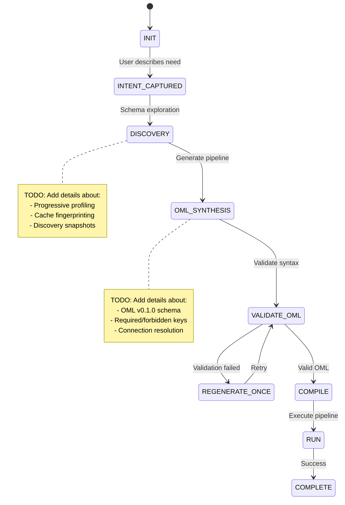
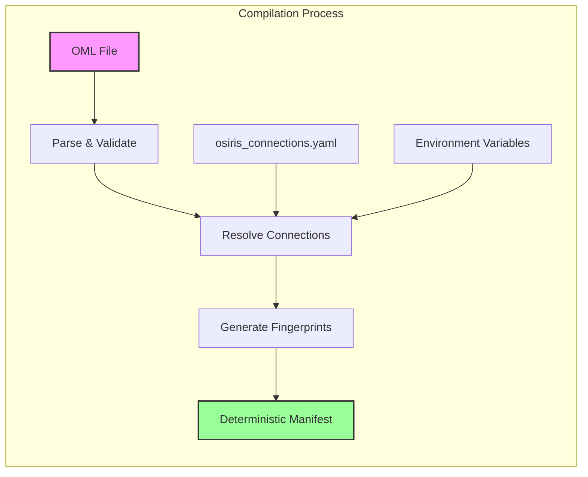
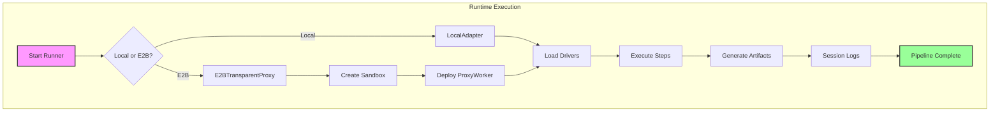

# Osiris Pipeline Overview

## Introduction

TODO: Write comprehensive introduction covering:
- What is Osiris Pipeline
- Key value proposition (LLM-first conversational ETL)
- Target audience (data engineers, analysts, ML engineers)
- How it differs from traditional ETL tools
- Quick example of conversational pipeline creation

## Conceptual Flow

TODO: Explain the high-level flow:
- User describes data needs in natural language
- AI discovers database schemas progressively
- OML (Osiris Markup Language) generation
- Compilation to deterministic manifest
- Execution in local or E2B cloud environment
- Session-scoped logging and artifacts

### Diagram 1: Chat → OML State Machine

## Detailed Execution

TODO: Deep dive into execution model:

### Local Execution
- ExecutionAdapter pattern
- LocalAdapter implementation
- Driver registration and lookup
- In-memory data caching between steps
- Artifact generation

### E2B Cloud Execution
- Transparent proxy architecture
- RPC communication protocol
- Sandbox lifecycle management
- Artifact synchronization
- Performance characteristics (<1% overhead)

### Diagram 2: Compile Pipeline

### Diagram 3: Run Pipeline

## Error Handling

TODO: Document error handling strategies:

### Compilation Errors
- OML validation failures
- Missing connections
- Invalid configurations
- Schema mismatches

### Runtime Errors
- Driver failures
- Connection issues
- Data validation errors
- E2B sandbox errors

### Recovery Strategies
- Retry policies
- HITL (Human-In-The-Loop) escalation
- Session preservation
- Partial execution recovery

### Error Reporting
- Structured error events
- Human-readable messages
- Debug information in logs
- Troubleshooting guides

## Performance Considerations

TODO: Add performance guidelines:
- Memory usage with large datasets
- Streaming vs in-memory processing
- E2B overhead characteristics
- Optimization strategies

## Security Model

TODO: Document security features:
- Secret masking in logs
- Connection isolation
- E2B sandbox security
- Data privacy considerations

## Next Steps

TODO: Link to other guides:
- [Getting Started Guide](user-guide/kickstart.md)
- [How-To Guide](user-guide/how-to.md)
- [Developer Guide](developer-guide/components.md)
- [API Reference](#) - TODO: Create API docs
