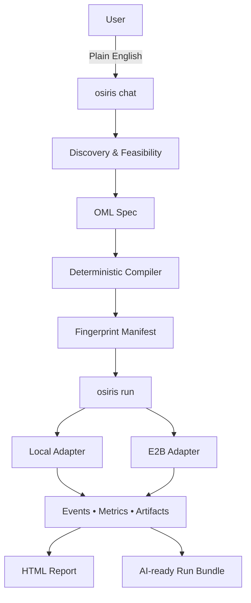

# Osiris Pipeline — Overview (v0.2.0)

Osiris is the **deterministic compiler for AI‑native data pipelines**.  
You describe outcomes in plain English; Osiris compiles them into **reproducible, production‑ready manifests** that run with the **same behavior everywhere** (local or cloud).

---

## 1) Executive Summary

**Breakthrough:** Osiris turns **ambiguous, plain‑language intent** into a **deterministic, portable pipeline** — without forcing teams to master a dozen tools. It combines the **creativity of AI** with the **safety of compilers**: same inputs → same outputs, every time.

**Why it matters (value):**
- **AI without chaos.** Guardrails, validation, and deterministic manifests make AI‑assisted pipelines **safe for production**.
- **Speed without fragility.** Idea → compiled pipeline **in minutes**, not weeks; fewer rewrites.
- **Portability without lock‑in.** **Parity adapters** run the same manifest anywhere (local or E2B today; Keboola/Kubernetes on the roadmap).
- **Transparency without toil.** Deep observability and **AI‑ready run bundles** make every run explainable to humans and usable by AI.

**Tagline:** *Osiris is the reliable bridge between human intent and machine execution for AI‑native data work.*

---

## 2) What Makes Osiris Different

- **Compiler, not orchestrator.** Others schedule what you hand‑craft. Osiris **generates, validates, and compiles** pipelines from plain English.
- **Determinism as a contract.** Fingerprinted manifests guarantee **reproducibility** across environments.
- **Conversational → executable.** Analysts, domain experts, and engineers can describe intent; Osiris interrogates real systems and proposes a **feasible** plan.
- **Run anywhere, same results.** Transparent adapters deliver **execution parity** (local and E2B today).
- **Boring by design.** Predictable, explainable, portable — **industrial‑grade** AI, not magical fragility.

---

## 3) Key Capabilities

- **Conversational Pipeline Synthesis.** Describe outcomes; Osiris explores available sources, asks clarifying questions, and synthesizes an **OML** (Osiris Markup Language) pipeline grounded in reality.
- **Deterministic Compiler & Runtime.** OML compiles to a **fingerprinted manifest**. If it compiles, it’s **production‑ready**: validated configs, resolved dependencies, and an execution plan.
- **Transparent Execution Adapters.** Run the same manifest **locally** or in **E2B sandboxes** with identical logs, metrics, and artifacts. *(Roadmap: Keboola, Kubernetes/OpenShift, enterprise schedulers.)*
- **Comprehensive Observability.** Structured **events + metrics**, interactive **HTML reports**, and an **AI‑ready Run Context Bundle** enable post‑mortems and “AI SRE” workflows.
- **Self‑Describing Component Registry.** JSON‑Schema specs power validation, secret masking, and rich LLM context. Adding components is intentionally simple. *(Planned community compatibility: Airbyte, Singer, Mage, Boomi, Keboola connectors.)*

> **Delivered in v0.2.0 (M1):** conversational → OML flow, deterministic compiler, local/E2B parity adapters, HTML reports, component registry, unified CLI.  
> **On the roadmap:** Scheduling & lineage (M2), streaming & parallelism (M3), Iceberg & DWH agent (M4), organizational memory.

---

## 4) How Osiris Works (at a glance)

1. **Chat** – `osiris chat` captures intent (e.g., “Identify customers inactive for 90 days and export a re‑activation list”); Osiris knows your **available connectors** and capability context.
2. **Synthesize OML** – The agent explores schemas, validates assumptions, and proposes an **OML pipeline**.
3. **Compile** – `osiris compile` validates OML and produces a **deterministic manifest** (your source of truth in Git).
4. **Run** – `osiris run` executes via adapters with **full parity** (add `--e2b` for sandboxed cloud execution).
5. **Observe** – `osiris logs html --open` shows interactive reports; the **AI bundle** enables automated analysis.

---

## 5) Who It’s For

- **Data Analysts:** self‑service pipelines without learning a stack.
- **Data Engineers:** standard, reproducible manifests; focus on the hard 10%.
- **ML/AI Teams:** fast, explainable data prep; AI‑ready run artifacts.
- **Leaders:** faster outcomes, fewer incidents, no lock‑in.

---

## 6) Roadmap & Ambition

- **M2 — Production Readiness:** workflows & approvals; **automatic impact analysis**; ownership that mirrors your org; native integration with existing orchestrators.
- **M3 — Technical Scale:** **limitless** scaling via chunking/parallelism; live health & clear cost controls.
- **M4 — Intelligent Persistence:** **Iceberg** tables and a **DWH Agent** that persists/serves datasets for pipelines and AI agents.

Throughout: **transparency, predictability, no vendor lock‑in, outcome‑first**.

---

## 7) License & Positioning

Open source under **Apache 2.0** (core). Run locally, in your cloud, or inside your orchestrator. You **own** what you depend on.

---

## 8) Quick Links

- **Quickstart:** [docs/quickstart.md](quickstart.md)
- **Architecture:** [docs/architecture.md](architecture.md)
- **User Guide:** [docs/user-guide/user-guide.md](user-guide/user-guide.md)
- **Examples:** [docs/examples/](examples/)
- **ADR Index:** [docs/adr/](adr/)
- **Roadmap:** [docs/roadmap/](roadmap/)

---

### Diagram — From Intent to Deterministic Execution

