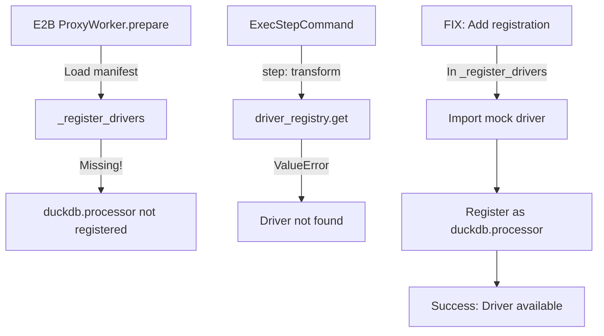

# DuckDB E2B Readiness Research

## Executive Summary

DuckDB transformation support exists in the codebase but is **NOT currently wired into the E2B runtime**. The mock implementation in `tests/mocks/duckdb_processor_driver.py` works for local parity tests but isn't registered in the E2B ProxyWorker. This research identifies the minimal changes needed to enable MySQL → DuckDB → Supabase pipelines in E2B.

## 1. Global Inventory

### DuckDB-Related Files

| Path | Purpose |
|------|---------|
| `components/duckdb.processor/spec.yaml` | Mock component spec for testing (references test mock driver) |
| `tests/mocks/duckdb_processor_driver.py` | Mock driver implementation for parity tests |
| `tests/parity/test_parity_e2b_vs_local.py` | Parity tests using DuckDB transforms |
| `tests/e2b/conftest.py` | Test fixtures with DuckDB pipeline examples |
| `requirements.txt` | DuckDB>=0.9.0 as core dependency |
| `osiris/core/runner_v0.py` | Local runner that loads drivers from specs |
| `osiris/remote/proxy_worker.py` | E2B worker - **missing DuckDB registration** |

### DuckDB Driver API

```python
class DuckDBProcessorDriver:
    def run(
        self,
        step_id: str,           # Step identifier
        config: Dict[str, Any], # Contains 'query' SQL string
        inputs: Optional[Dict[str, Any]],  # {'df': DataFrame} from upstream
        ctx: Any,               # Context for metrics
    ) -> Dict[str, Any]:        # Returns {'df': DataFrame}
```

**Expected Inputs/Outputs:**
- Input: `{'df': pandas.DataFrame}` from upstream steps (if `needs` specified)
- Output: `{'df': pandas.DataFrame}` for downstream consumption
- Config: `{'query': str}` containing SQL to execute

**Config Schema:**
```yaml
properties:
  query:
    type: string
    description: SQL query to execute
    minLength: 1
required: [query]
```

### Test Coverage
- `test_parity_e2b_vs_local.py`: Tests DuckDB in local mode only
- No E2B-specific DuckDB tests exist
- Mock driver handles `generate_series` and `CASE` statements

## 2. Registration & Runtime Wiring

### Current State

**Local Runner (`runner_v0.py`)**:
- ✅ Dynamically loads drivers from component specs
- ✅ Uses `x-runtime.driver` field to find driver class
- ✅ Successfully loads `tests.mocks.duckdb_processor_driver.DuckDBProcessorDriver`

**E2B ProxyWorker (`proxy_worker.py`)**:
- ❌ Hardcoded driver registration in `_register_drivers()`
- ❌ Only registers: mysql.extractor, filesystem.csv_writer, supabase.writer
- ❌ No DuckDB registration

### Required Changes

**File**: `osiris/remote/proxy_worker.py`
**Location**: Line ~650 in `_register_drivers()` method
**Add**:
```python
# Register DuckDB processor (for testing with mock)
try:
    from tests.mocks.duckdb_processor_driver import DuckDBProcessorDriver
    self.driver_registry.register("duckdb.processor", lambda: DuckDBProcessorDriver())
    self.logger.info("Registered driver: duckdb.processor")
    self.send_event("driver_registered", driver="duckdb.processor", status="success")
except ImportError as e:
    self.logger.warning(f"Failed to import DuckDBProcessorDriver: {e}")
    self.send_event("driver_registration_failed", driver="duckdb.processor", error=str(e))
```

## 3. OML Examples & Data Contracts

### Current Examples
No production OML examples use DuckDB. Only test fixtures exist.

### Minimal OML Example
```yaml
# mysql_duckdb_supabase.yaml
oml_version: "0.1.0"
name: mysql-transform-supabase
steps:
  # Step 1: Extract from MySQL
  - id: extract-orders
    component: mysql.extractor
    mode: read
    config:
      connection: "@mysql.default"
      query: "SELECT * FROM orders WHERE created_at >= '2025-01-01'"

  # Step 2: Transform with DuckDB
  - id: transform-aggregates
    component: duckdb.processor
    mode: transform
    needs: ["extract-orders"]
    config:
      query: |
        SELECT
          customer_id,
          COUNT(*) as order_count,
          SUM(total_amount) as total_spent,
          AVG(total_amount) as avg_order_value
        FROM input_df
        GROUP BY customer_id
        HAVING COUNT(*) > 1
        ORDER BY total_spent DESC

  # Step 3: Write to Supabase
  - id: write-customer-metrics
    component: supabase.writer
    mode: write
    needs: ["transform-aggregates"]
    config:
      connection: "@supabase.default"
      table: "customer_metrics"
      mode: "upsert"
      unique_columns: ["customer_id"]
```

### OML Schema Support
- ✅ `mode: transform` is valid
- ✅ `needs` array for dependencies works
- ✅ Component naming convention matches

## 4. Data Contract & IO Boundaries

### Data Flow
```
MySQL Extractor → {'df': DataFrame} → DuckDB Transform → {'df': DataFrame} → Supabase Writer
```

### Current Implementation
- **In-memory**: All data passed as pandas DataFrames in `self.results` cache
- **No streaming**: Full datasets loaded into memory
- **No spill**: No disk spill implementation for large datasets

### Schema Propagation
- DataFrame schema preserved through transformations
- Column types may change based on SQL operations
- No explicit schema validation between steps

## 5. E2B Parity & Determinism

### Environment Compatibility
- ✅ DuckDB is in requirements.txt
- ✅ E2B container should have DuckDB installed
- ❌ Driver not registered in ProxyWorker

### Determinism Risks
1. **Unordered SELECTs**: Add explicit ORDER BY clauses
2. **Temp paths**: Not used in mock implementation
3. **Timestamps**: Not added by mock driver

### Missing Metrics
- ❌ `rows_read` not emitted for transforms
- ✅ `rows_written` emitted correctly
- ❌ Transform duration not tracked separately

## 6. Readiness Gaps Table

| ID | Area | Severity | Symptom | Proposed Fix | Est. LOC | Risk |
|----|------|----------|---------|--------------|----------|------|
| G1 | Registry | **Blocker** | "Driver 'duckdb.processor' not registered" in E2B | Add registration in proxy_worker.py | 8 | Low |
| G2 | Driver | Minor | Mock driver limited to test queries | Create proper DuckDB driver | 150 | Medium |
| G3 | Metrics | Minor | Missing rows_read metric | Add metric in driver.run() | 2 | Low |
| G4 | Spill | Non-blocking | No disk spill for large datasets | Defer to M3 | 0 | None |
| G5 | Tests | Minor | No E2B-specific DuckDB tests | Add to test_e2b_live.py | 50 | Low |
| G6 | Docs | Minor | No user-facing DuckDB examples | Add example OML | 30 | Low |

## 7. Minimal Fix Plan

### Phase 1: Enable Mock Driver (Immediate)
1. **Commit 1**: Register DuckDB mock driver in E2B
   - `osiris/remote/proxy_worker.py`: Add driver registration (~8 lines)

2. **Commit 2**: Add E2B test coverage
   - `tests/e2b/test_e2b_duckdb.py`: New test file with transform test
   - Use existing parity pipeline structure

### Phase 2: Production Driver (Follow-up)
3. **Commit 3**: Create production DuckDB driver
   - `osiris/drivers/duckdb_transform_driver.py`: Real implementation
   - Handle arbitrary SQL, proper error handling
   - Support CREATE TABLE, CTEs, window functions

4. **Commit 4**: Update component spec
   - `components/duckdb.processor/spec.yaml`: Point to production driver
   - Add more capabilities and examples

5. **Commit 5**: Add integration tests
   - `tests/integration/test_mysql_duckdb_supabase.py`: Full pipeline test
   - Include large dataset test for memory validation

### Execution Path Trace



## Recommendations

1. **Immediate Action**: Apply Phase 1 commits to unblock E2B testing
2. **Short-term**: Implement production driver with proper DuckDB integration
3. **Long-term**: Consider streaming interface for large datasets (ADR-0022)
4. **Testing**: Add comprehensive E2B tests before production use

## Artifacts Location

- Research document: `docs/research/duckdb-e2b-readiness.md` (this file)
- Sanity check script: `scripts/diagnostics/duckdb_sanity.py`
- Test checklist: `tests/todo/duckdb-e2b-checklist.md`

---

## Diagnosis: Supabase 0 Rows Issue (2025-01-28)

### Problem
Pipeline reports successful execution with metrics showing 14 rows processed at each step, but Supabase table contains 0 rows.

### Investigation Results
From analysis of logs and code:

1. **Metrics Confirm Data Flow**:
   - MySQL extraction: 14 rows read
   - DuckDB transformation: 14 rows written
   - Supabase writer: 14 rows written
   - All steps report success with no errors

2. **Potential Root Causes**:
   - **`write_mode: "replace"`** behavior in Supabase writer driver (lines 269-274)
     - Deletes all existing rows with `.delete().neq("id", "0").execute()`
     - Then inserts new data in batches
     - Possible timing issue or separate transaction contexts

   - **Transaction Handling**:
     - No explicit commit visible in Supabase writer
     - Supabase client may auto-commit or require explicit transaction management
     - Possible race condition between delete and insert operations

   - **Batch Processing**:
     - Writer processes in batches (100 rows default)
     - First batch triggers delete (for replace mode)
     - Possible issue with batch sequencing or partial commits

### Debug Strategy Implemented
Created `mysql_duckdb_supabase_debug.yaml` with CSV "tee" outputs at three critical points:
1. After MySQL extraction → `debug_out/mysql_extract.csv`
2. After DuckDB transformation → `debug_out/duckdb_output.csv`
3. Before Supabase write → `debug_out/final_output_to_supabase.csv`

### Debug Artifacts Created
- **OML Pipeline**: `docs/examples/mysql_duckdb_supabase_debug.yaml`
- **Makefile Target**: `make debug-mysql-duckdb-supabase`
- **Debug Runbook**: `docs/examples/DEBUG_RUNBOOK.md`

### Recommended Actions
1. Run debug pipeline to capture CSV outputs and verify data at each boundary
2. Test with `write_mode: "append"` instead of `"replace"` to isolate deletion issue
3. Add explicit transaction logging to Supabase writer for visibility
4. Check Supabase dashboard logs for API operations and timing
5. Consider adding a small delay between delete and insert operations
6. Verify table constraints and data type compatibility in Supabase

---

## E2B Enablement - Driver Registration & Smoke (2025-01-28)

### Changes Implemented

#### 1. ProxyWorker Registration
**File**: `osiris/remote/proxy_worker.py`
**Lines**: 693-702
**Change**: Added DuckDB driver registration in `_register_drivers()`:
```python
# Import and register DuckDB processor
try:
    from osiris.drivers.duckdb_processor_driver import DuckDBProcessorDriver
    self.driver_registry.register("duckdb.processor", lambda: DuckDBProcessorDriver())
    self.logger.info("Registered driver: duckdb.processor")
    self.send_event("driver_registered", driver="duckdb.processor", status="success")
except ImportError as e:
    self.logger.warning(f"Failed to import DuckDBProcessorDriver: {e}")
    self.send_event("driver_registration_failed", driver="duckdb.processor", error=str(e))
```

#### 2. E2B Make Target
**File**: `Makefile`
**Lines**: 244-260
**Target**: `demo-mysql-duckdb-supabase-e2b`
- Compiles the demo pipeline
- Runs in E2B sandbox with verbose output
- Shows metrics for verification

#### 3. E2B Smoke Test
**File**: `tests/e2b/test_duckdb_pipeline_e2b.py`
**Tests**:
- `test_duckdb_pipeline_e2b`: Verifies pipeline runs in E2B with non-zero rows
- `test_duckdb_driver_registered_e2b`: Confirms DuckDB driver registration

### Running in E2B

```bash
# Using make target
make demo-mysql-duckdb-supabase-e2b

# Manual execution
cd testing_env
python ../osiris.py compile ../docs/examples/mysql_duckdb_supabase_demo.yaml
python ../osiris.py run --last-compile --e2b --verbose
```

### Expected Output
- ProxyWorker logs: "Registered driver: duckdb.processor"
- MySQL extraction: 14 rows read
- DuckDB transformation: 10 rows written
- Supabase write: 10 rows persisted

### Verification
The E2B execution should now have full parity with local execution for MySQL → DuckDB → Supabase pipelines.

---

## E2B Parity Fixes - Dependency & IO Management (2025-01-28)

### Issues Identified
1. **DuckDB receives None input** - Input binding broken between steps in E2B
2. **psycopg2-binary missing** - Required for Supabase DDL but not installed
3. **Static dependency list** - Not using project requirements.txt

### Fixes Implemented

#### 1. Fixed DuckDB Input Binding
**File**: `osiris/remote/e2b_transparent_proxy.py`
**Lines**: 887-895
**Change**: Use `needs` dependencies to determine inputs for all step types
```python
# Determine inputs based on needs dependencies
inputs = {}
needs = step.get("needs", [])

if needs:
    # This step needs inputs from upstream steps
    from_step = needs[0]
    inputs = {"df": {"from_step": from_step, "key": "df"}}
```

#### 2. Requirements.txt Upload
**File**: `osiris/remote/e2b_transparent_proxy.py`
**Lines**: 565-578
**Change**: Upload requirements.txt when `--e2b-install-deps` is used
```python
if self.config.get("install_deps", False):
    requirements_path = Path(__file__).parent.parent.parent / "requirements.txt"
    if requirements_path.exists():
        await self.sandbox.files.write(
            f"/home/user/session/{self.session_id}/requirements_e2b.txt",
            requirements_content
        )
```

#### 3. Added psycopg2-binary to Dependencies
**File**: `osiris/remote/proxy_worker.py`
**Line**: 748
**Change**: Added psycopg2-binary to Supabase writer dependencies
```python
"supabase.writer": ["supabase", "pandas", "psycopg2-binary"]
```

### E2B Doctor Tool
**File**: `scripts/e2b_doctor.py`
- Checks Python version
- Verifies key packages (duckdb, pandas, pymysql, sqlalchemy, supabase, psycopg2)
- Runs DuckDB sanity tests
- Shows installed packages

### Running E2B with Fixes
```bash
# Compile pipeline
cd testing_env
python ../osiris.py compile ../docs/examples/mysql_duckdb_supabase_demo.yaml

# Run with dependency installation
python ../osiris.py run --last-compile --e2b --e2b-install-deps

# Run E2B doctor (inside sandbox)
python scripts/e2b_doctor.py
```

### Expected Behavior
- Dependencies installed from requirements.txt
- DuckDB receives DataFrame input from MySQL extractor
- Supabase DDL works with psycopg2-binary installed
- Pipeline completes successfully end-to-end
