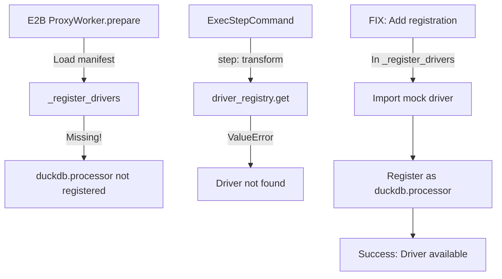

# DuckDB E2B Readiness Research

## Executive Summary

DuckDB transformation support exists in the codebase but is **NOT currently wired into the E2B runtime**. The mock implementation in `tests/mocks/duckdb_processor_driver.py` works for local parity tests but isn't registered in the E2B ProxyWorker. This research identifies the minimal changes needed to enable MySQL → DuckDB → Supabase pipelines in E2B.

## 1. Global Inventory

### DuckDB-Related Files

| Path | Purpose |
|------|---------|
| `components/duckdb.processor/spec.yaml` | Mock component spec for testing (references test mock driver) |
| `tests/mocks/duckdb_processor_driver.py` | Mock driver implementation for parity tests |
| `tests/parity/test_parity_e2b_vs_local.py` | Parity tests using DuckDB transforms |
| `tests/e2b/conftest.py` | Test fixtures with DuckDB pipeline examples |
| `requirements.txt` | DuckDB>=0.9.0 as core dependency |
| `osiris/core/runner_v0.py` | Local runner that loads drivers from specs |
| `osiris/remote/proxy_worker.py` | E2B worker - **missing DuckDB registration** |

### DuckDB Driver API

```python
class DuckDBProcessorDriver:
    def run(
        self,
        step_id: str,           # Step identifier
        config: Dict[str, Any], # Contains 'query' SQL string
        inputs: Optional[Dict[str, Any]],  # {'df': DataFrame} from upstream
        ctx: Any,               # Context for metrics
    ) -> Dict[str, Any]:        # Returns {'df': DataFrame}
```

**Expected Inputs/Outputs:**
- Input: `{'df': pandas.DataFrame}` from upstream steps (if `needs` specified)
- Output: `{'df': pandas.DataFrame}` for downstream consumption
- Config: `{'query': str}` containing SQL to execute

**Config Schema:**
```yaml
properties:
  query:
    type: string
    description: SQL query to execute
    minLength: 1
required: [query]
```

### Test Coverage
- `test_parity_e2b_vs_local.py`: Tests DuckDB in local mode only
- No E2B-specific DuckDB tests exist
- Mock driver handles `generate_series` and `CASE` statements

## 2. Registration & Runtime Wiring

### Current State

**Local Runner (`runner_v0.py`)**:
- ✅ Dynamically loads drivers from component specs
- ✅ Uses `x-runtime.driver` field to find driver class
- ✅ Successfully loads `tests.mocks.duckdb_processor_driver.DuckDBProcessorDriver`

**E2B ProxyWorker (`proxy_worker.py`)**:
- ❌ Hardcoded driver registration in `_register_drivers()`
- ❌ Only registers: mysql.extractor, filesystem.csv_writer, supabase.writer
- ❌ No DuckDB registration

### Required Changes

**File**: `osiris/remote/proxy_worker.py`
**Location**: Line ~650 in `_register_drivers()` method
**Add**:
```python
# Register DuckDB processor (for testing with mock)
try:
    from tests.mocks.duckdb_processor_driver import DuckDBProcessorDriver
    self.driver_registry.register("duckdb.processor", lambda: DuckDBProcessorDriver())
    self.logger.info("Registered driver: duckdb.processor")
    self.send_event("driver_registered", driver="duckdb.processor", status="success")
except ImportError as e:
    self.logger.warning(f"Failed to import DuckDBProcessorDriver: {e}")
    self.send_event("driver_registration_failed", driver="duckdb.processor", error=str(e))
```

## 3. OML Examples & Data Contracts

### Current Examples
No production OML examples use DuckDB. Only test fixtures exist.

### Minimal OML Example
```yaml
# mysql_duckdb_supabase.yaml
oml_version: "0.1.0"
name: mysql-transform-supabase
steps:
  # Step 1: Extract from MySQL
  - id: extract-orders
    component: mysql.extractor
    mode: read
    config:
      connection: "@mysql.default"
      query: "SELECT * FROM orders WHERE created_at >= '2025-01-01'"

  # Step 2: Transform with DuckDB
  - id: transform-aggregates
    component: duckdb.processor
    mode: transform
    needs: ["extract-orders"]
    config:
      query: |
        SELECT
          customer_id,
          COUNT(*) as order_count,
          SUM(total_amount) as total_spent,
          AVG(total_amount) as avg_order_value
        FROM input_df
        GROUP BY customer_id
        HAVING COUNT(*) > 1
        ORDER BY total_spent DESC

  # Step 3: Write to Supabase
  - id: write-customer-metrics
    component: supabase.writer
    mode: write
    needs: ["transform-aggregates"]
    config:
      connection: "@supabase.default"
      table: "customer_metrics"
      mode: "upsert"
      unique_columns: ["customer_id"]
```

### OML Schema Support
- ✅ `mode: transform` is valid
- ✅ `needs` array for dependencies works
- ✅ Component naming convention matches

## 4. Data Contract & IO Boundaries

### Data Flow
```
MySQL Extractor → {'df': DataFrame} → DuckDB Transform → {'df': DataFrame} → Supabase Writer
```

### Current Implementation
- **In-memory**: All data passed as pandas DataFrames in `self.results` cache
- **No streaming**: Full datasets loaded into memory
- **No spill**: No disk spill implementation for large datasets

### Schema Propagation
- DataFrame schema preserved through transformations
- Column types may change based on SQL operations
- No explicit schema validation between steps

## 5. E2B Parity & Determinism

### Environment Compatibility
- ✅ DuckDB is in requirements.txt
- ✅ E2B container should have DuckDB installed
- ❌ Driver not registered in ProxyWorker

### Determinism Risks
1. **Unordered SELECTs**: Add explicit ORDER BY clauses
2. **Temp paths**: Not used in mock implementation
3. **Timestamps**: Not added by mock driver

### Missing Metrics
- ❌ `rows_read` not emitted for transforms
- ✅ `rows_written` emitted correctly
- ❌ Transform duration not tracked separately

## 6. Readiness Gaps Table

| ID | Area | Severity | Symptom | Proposed Fix | Est. LOC | Risk |
|----|------|----------|---------|--------------|----------|------|
| G1 | Registry | **Blocker** | "Driver 'duckdb.processor' not registered" in E2B | Add registration in proxy_worker.py | 8 | Low |
| G2 | Driver | Minor | Mock driver limited to test queries | Create proper DuckDB driver | 150 | Medium |
| G3 | Metrics | Minor | Missing rows_read metric | Add metric in driver.run() | 2 | Low |
| G4 | Spill | Non-blocking | No disk spill for large datasets | Defer to M3 | 0 | None |
| G5 | Tests | Minor | No E2B-specific DuckDB tests | Add to test_e2b_live.py | 50 | Low |
| G6 | Docs | Minor | No user-facing DuckDB examples | Add example OML | 30 | Low |

## 7. Minimal Fix Plan

### Phase 1: Enable Mock Driver (Immediate)
1. **Commit 1**: Register DuckDB mock driver in E2B
   - `osiris/remote/proxy_worker.py`: Add driver registration (~8 lines)

2. **Commit 2**: Add E2B test coverage
   - `tests/e2b/test_e2b_duckdb.py`: New test file with transform test
   - Use existing parity pipeline structure

### Phase 2: Production Driver (Follow-up)
3. **Commit 3**: Create production DuckDB driver
   - `osiris/drivers/duckdb_transform_driver.py`: Real implementation
   - Handle arbitrary SQL, proper error handling
   - Support CREATE TABLE, CTEs, window functions

4. **Commit 4**: Update component spec
   - `components/duckdb.processor/spec.yaml`: Point to production driver
   - Add more capabilities and examples

5. **Commit 5**: Add integration tests
   - `tests/integration/test_mysql_duckdb_supabase.py`: Full pipeline test
   - Include large dataset test for memory validation

### Execution Path Trace



## Recommendations

1. **Immediate Action**: Apply Phase 1 commits to unblock E2B testing
2. **Short-term**: Implement production driver with proper DuckDB integration
3. **Long-term**: Consider streaming interface for large datasets (ADR-0022)
4. **Testing**: Add comprehensive E2B tests before production use

## Artifacts Location

- Research document: `docs/research/duckdb-e2b-readiness.md` (this file)
- Sanity check script: `scripts/diagnostics/duckdb_sanity.py`
- Test checklist: `tests/todo/duckdb-e2b-checklist.md`
