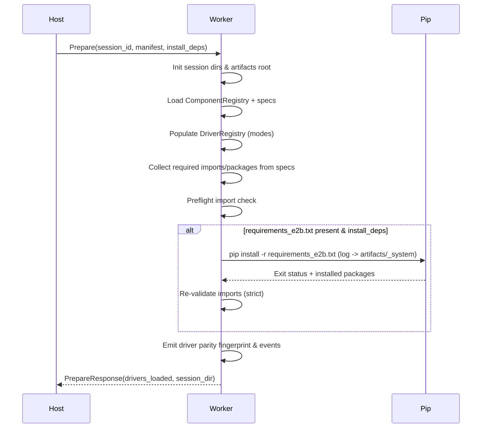

# E2B ProxyWorker Auto-Registration & Dependency Plan

## Current State
- ProxyWorker manually registers four drivers (MySQL extractor, filesystem CSV writer, Supabase writer, DuckDB processor) via ad-hoc factory lambdas.
- Dependency checks use a hard-coded mapping from driver name to Python modules and fall back to `pip install <module>` if allowed.
- `requirements_e2b.txt` is uploaded, but the worker only installs from it when dependencies are already missing and `--e2b-install-deps` is enabled.
- Driver registry is initialised *after* dependency checks, so failure to import modules prevents registration telemetry.
- IO contract for step hand-off keeps DataFrames in memory only. No deterministic artifact (e.g. Parquet) is produced, so parity comparisons and downstream retries are brittle.
- Secrets in compiled configs are filtered via substring heuristics (`password`, `key`, etc.), leading to false positives/negatives.
- Supabase writer `replace` mode truncates tables via brittle HTTP delete heuristics, lacks anti-delete safeguards, and emits minimal DDL telemetry.

## Proposed Behaviour
1. Initialise `DriverRegistry` from `ComponentRegistry` for both local and E2B paths using a shared helper (`populate_from_component_specs`). Modes `{extract, transform, write, read}` limit scope but retain parity with local runner.
2. Collect per-component runtime requirements from `x-runtime.requirements.imports` and verify modules before registration.
3. If auto-install enabled, install via `requirements_e2b.txt` (and optional `requirements.lock` / `uv.lock`) before re-validating imports. Persist a pip log artifact.
4. Emit detailed registration summary (`drivers_registered`, fingerprint, per-driver success/failure) and parity hash for host comparison.
5. Enforce deterministic IO contract: upstream outputs are always written to `artifacts/<step>/output.parquet`. `_resolve_inputs` loads Parquet into `inputs['df']`, emits `inputs_resolved`, and tracks row counts for run-card generation.
6. Replace substring secret filtering with explicit metadata: compiler derives secret keys from component `secrets`/`x-secret` pointers, and ProxyWorker masks according to the same list.
7. Supabase writer enhancements:
   - `ddl_channel` config (`auto|http_sql|psycopg2`). Auto attempts HTTP SQL first (if configured), then psycopg2 with IPv4 host enforcement.
   - `replace` now performs upsert + anti-delete based on primary key values (composite supported), with telemetry (`ddl_attempt`, `ddl_succeeded`, `ddl_failed`).
   - Rows-in/out metrics and run-card data recorded for each step.

## Startup Sequence

## Migration Phases
- **Phase 1 (This patch):** Enable auto-registration, spec-driven dependency checks, Parquet hand-off, secrets sanitisation, Supabase DDL policy, and run-card output. All changes gated behind existing CLI flags.
- **Phase 2:** Update orchestrator to consume `drivers_registered` fingerprint and short-circuit mismatches in parity tests.
- **Phase 3:** Introduce optional manifest fingerprint exchange so host can preflight driver parity before sandbox spin-up.

## Risks & Mitigations
- **Spec gaps:** Components lacking `x-runtime.requirements` could miss dependency checks. Mitigation: default to empty list; add tests to ensure new components supply imports.
- **HTTP SQL variability:** Not all deployments expose `sql_url`. Auto mode logs failure and falls back to psycopg2.
- **Parquet dependency:** Requires `pyarrow`. Added to `requirements.txt` and spec runtime requirements; install step verifies presence.
- **psycopg2 network issues:** IPv6-only DSNs previously failed. We resolve IPv4 host addresses before connecting; failure emits `ddl_failed` for observability.

## Roll-out Checklist
1. Merge patch; run new unit tests (`pytest tests/e2b/test_driver_parity.py tests/e2b/test_requirements_install.py tests/compiler/test_primary_key_preserved.py tests/writers/test_supabase_replace_matrix.py`).
2. Update orchestrator to honour `drivers_registered.fingerprint` (Phase 2 follow-up PR).
3. Publish developer note covering new `ddl_channel` config and Parquet contract for downstream drivers.
