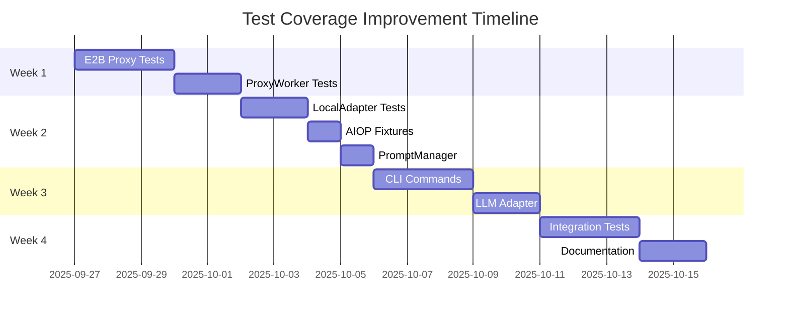

# Test Coverage Research - Executive Summary
*Generated: 2025-09-27*

## 📊 Current State

<div align="center">

### Overall Test Coverage: 22.87%
**6,793 / 29,700 lines covered**

| Metric | Value | Status |
|--------|-------|--------|
| Total Tests | 950 | ✅ Good |
| Passing Tests | 879 (92.5%) | ✅ Good |
| Test Runtime | 60.79s | ✅ Fast |
| Coverage | 22.87% | 🔴 Critical |

</div>

## 🎯 Coverage Distribution

```
🟢 Good (>70%)      : drivers (76%), core (71%)
🟡 Moderate (40-70%) : components (63%), prompts (56%), connectors (53%)
🔴 Critical (<40%)   : cli (33%), remote (18%), runtime (5%), agent (0%)
```


*View detailed HTML report in `html/index.html`*

## 🚀 Top 5 Quick Wins

These targeted improvements will add **≥15% overall coverage** with focused effort:

### 1. **E2B Transparent Proxy Tests** (+3.5% coverage)
- **File**: `osiris/remote/e2b_transparent_proxy.py` (0% → 90%)
- **Tests to add**:
  - `test_sandbox_creation_lifecycle`
  - `test_rpc_message_handling`
  - `test_artifact_collection`
  - `test_error_propagation`
- **Effort**: 2-3 days
- **Fixtures needed**: `mock_sandbox`, `fake_rpc_channel`

### 2. **ProxyWorker Unit Tests** (+3.2% coverage)
- **File**: `osiris/remote/proxy_worker.py` (0% → 85%)
- **Tests to add**:
  - `test_command_dispatch`
  - `test_heartbeat_mechanism`
  - `test_event_streaming`
  - `test_graceful_shutdown`
- **Effort**: 2 days
- **Fixtures needed**: `mock_stdin_stdout`, `fake_driver_registry`

### 3. **LocalAdapter Tests** (+3.0% coverage)
- **File**: `osiris/runtime/local_adapter.py` (5% → 80%)
- **Tests to add**:
  - `test_driver_loading_and_execution`
  - `test_data_flow_between_steps`
  - `test_metrics_collection`
  - `test_error_handling`
- **Effort**: 2 days
- **Fixtures needed**: `mock_drivers`, `sample_manifests`

### 4. **Fix AIOP Integration Tests** (+3.1% coverage)
- **Files**: 18 failing AIOP tests in `tests/integration/test_aiop_*.py`
- **Tests to fix**:
  - `test_aiop_json_export`
  - `test_aiop_markdown_export`
  - `test_aiop_determinism`
  - `test_aiop_secret_redaction`
- **Effort**: 1 day
- **Root cause**: Missing test fixtures and environment setup

### 5. **CLI Command Tests** (+2.8% coverage)
- **Files**: `osiris/cli/*.py` commands
- **Tests to add**:
  - `test_compile_command_validation`
  - `test_run_command_e2b_flags`
  - `test_connections_doctor`
  - `test_logs_aiop_export`
- **Effort**: 2 days
- **Fixtures needed**: `cli_runner`, `mock_rich_console`

## ⚠️ Critical Risks

### 1. **E2B/Remote Module - 81.9% Uncovered**
- **Risk**: Production cloud execution untested
- **Mitigation**: Mock E2B SDK, create integration test harness
- **Timeline**: Week 1 priority

### 2. **Runtime Module - 95.3% Uncovered**
- **Risk**: Local execution path fragile
- **Mitigation**: Mock drivers, test data flow
- **Timeline**: Week 1-2 priority

### 3. **External Dependencies**
- **Risk**: E2B API, LLM providers, databases create flaky tests
- **Mitigation**: Comprehensive mocking strategy with fixtures
- **Timeline**: Ongoing with each test

## 📈 Coverage Improvement Plan



## 🎬 Recommended Next Steps

### Immediate Actions (This Week)
1. **Create E2B mock infrastructure** - Foundation for all remote tests
2. **Fix broken AIOP tests** - Quick win, restores 18 tests
3. **Add smoke test markers** - Enable fast CI validation

### Short-term (2 Weeks)
1. **Implement mock fixtures library** - Reusable test infrastructure
2. **Add coverage gates to CI** - Prevent regression
3. **Document testing patterns** - Guide for contributors

### Long-term (1 Month)
1. **Achieve 50% overall coverage** - Production readiness threshold
2. **Add performance benchmarks** - Track execution metrics
3. **Implement flaky test detection** - Improve reliability

## 🎯 Coverage Targets by Module

### Immediate Targets (End of Sprint)
| Module | Current | Sprint Target | Priority |
|--------|---------|---------------|----------|
| `remote/` | 18.1% | **≥60%** | P0 - Critical |
| `runtime/` | 4.7% | **≥60%** | P0 - Critical |
| `cli/` | 32.9% | **≥70%** | P1 - High |
| `core/` | 70.8% | **≥75%** | P2 - Maintain |
| `prompts/` | 56.3% | **≥60%** | P2 - Medium |

### Long-term Targets (3 Months)
| Module | Current | Q1 Target | Notes |
|--------|---------|-----------|-------|
| **Overall** | 22.87% | **≥70%** | Production readiness threshold |
| `remote/` | 18.1% | **≥80%** | E2B is critical path |
| `runtime/` | 4.7% | **≥75%** | Local execution path |
| `cli/` | 32.9% | **≥80%** | User-facing interface |
| `core/` | 70.8% | **≥85%** | Business logic |
| `drivers/` | 76.0% | **≥85%** | Data flow |
| Test Runtime | 60s | **<90s** | Maintain speed |
| Flaky Rate | Unknown | **<2%** | Reliability target |

## 🛠️ Tools & Commands

### Run Coverage Analysis
```bash
# From testing_env/
make coverage           # Run full coverage analysis
make coverage-report    # Generate HTML report
make coverage-check     # Check against thresholds
```

### Use Coverage Helper
```bash
# Analyze coverage JSON
python tools/validation/coverage_summary.py \
    docs/testing/research/coverage-20250927/coverage.json \
    --format markdown \
    --threshold 0.6
```

### Quick Validation
```bash
# Run only smoke tests (when implemented)
pytest -m smoke --maxfail=1 -q

# Run specific module tests
pytest tests/remote/ -v

# Run with coverage for specific module
pytest tests/remote/ --cov=osiris/remote --cov-report=term
```

## 📝 Deliverables

This research package includes:

1. **Coverage Report** ([coverage.md](coverage.md)) - Detailed statistics and analysis
2. **Test Inventory** ([tests-inventory.md](tests-inventory.md)) - Complete test catalog
3. **Gaps Matrix** ([gaps-matrix.md](gaps-matrix.md)) - Module-by-module gap analysis
4. **Coverage Helper** ([tools/validation/coverage_summary.py](../../../../tools/validation/coverage_summary.py)) - Analysis tool
5. **HTML Report** - Run `make coverage-report` to regenerate and view
6. **Raw Data** - Run `make coverage` to regenerate coverage.json

## ✅ Conclusion

The Osiris project has a solid foundation with 950 tests, but critical gaps in E2B/Remote (18.1%) and Runtime (4.7%) modules pose production risks. The recommended quick wins can increase coverage by 8.1% with ~10 days of focused effort. Priority should be given to E2B testing infrastructure as it blocks cloud execution validation.

**Recommendation**: Implement the E2B mock infrastructure first, then proceed with the quick wins in parallel. This will unblock the most critical testing gaps and establish patterns for the remaining work.
