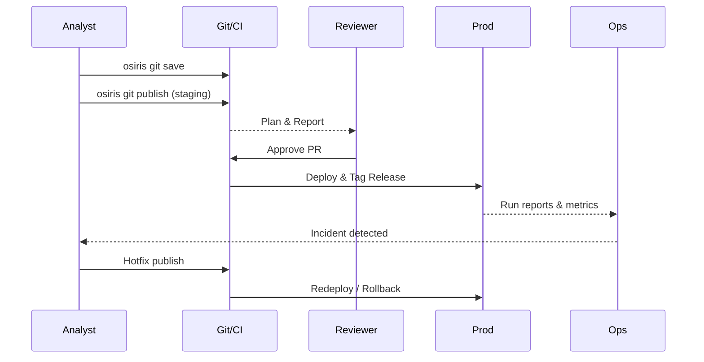

# Osiris Git Blueprint

This document provides a high-level blueprint of how Git collaboration works in Osiris for data teams. It is designed for data leaders (e.g., CDOs) who want to understand the philosophy, user scenarios, and workflows without diving into low-level technical details or ADRs.

## Executive Summary

This paper is a practical blueprint for how Git collaboration would work for a large data team using Osiris. 

**Purpose:** Validate that the proposed workflows (design → review → staging → prod → incident fix) are realistic for day‑to‑day team operations.

**What to look for:** 
- Are the user roles and handoffs clear (analyst, engineer, reviewer, ops)?
- Does the staging/production separation cover how you test safely?
- Are rollback, hotfixes, and auditability handled the way your team expects?
- Is anything missing for governance, privacy, or compliance?

**Scope:** Keep the focus on collaboration mechanics and operational guardrails. This is not a ROI comparison or migration plan.

---

## Why Git?

Git is the backbone of collaboration. It provides version control, auditability, and safe coordination for large teams.
Osiris builds on Git and adds an **autopilot mode**: non-technical users interact with simple commands, while data engineers and reviewers retain full control through Git best practices.

## Core Philosophy

- **Simplicity for business users**: they see only `Save → Publish → History → Undo`.
- **Governance for data engineers**: they use Git features like review, CI checks, release tags, and rollback.
- **Reliability for production**: every change is audited, reproducible, and reversible.
- **Transparency for management**: every pipeline change can be traced back to the "who, when, why" with linked reports.

## Scale & Integration Readiness

### Proven at Scale
- Supports large teams and high pipeline volumes (e.g., 100+ contributors, thousands of pipelines)
- Handles high data and run volumes without Git performance issues
- Enables geographically distributed teams to collaborate asynchronously

### Enterprise Integration
- Integrates with identity providers (LDAP, SAML, OAuth) for single sign-on
- Native support for major data platforms (Snowflake, Databricks, BigQuery, Redshift, Motherduck, Iceberg)
- Works alongside or replaces orchestrators (Airflow, Prefect, Orchestra, Dagster,...)
- Exports monitoring metrics to observability tools (Datadog, New Relic, CloudWatch)
- Syncs data lineage to catalog tools (Collibra, Alation, DataHub)

---

## User Scenarios in a Large Data Team

The following examples illustrate how a typical large enterprise data team might use Osiris Git workflows. They are fictional but reflect realistic situations.

### 1. Designing a New Pipeline

**Scenario:**  
Anna, a data analyst, is tasked with building a pipeline to bring Salesforce opportunities into the data warehouse.

- She creates a new pipeline `pipelines/salesforce_opportunities.oml`.  
- Locally, she tests it on a subset of records with `osiris git save`.  
- Once happy, she runs `osiris git publish`.  
- CI automatically compiles the pipeline, validates schema compatibility, and generates a **plan report**: showing which tables will be created and what transformations will run.  
- Tom, a data engineer, reviews the report in the PR and confirms it follows team standards.  

Outcome: The pipeline is safely staged for team review without touching production.

---

### 2. Testing and Debugging

**Scenario:**  
The marketing team wants a pipeline to enrich customer data with campaign responses. During tests, the join logic seems off.

- Priya, the pipeline author, publishes to the **staging environment** with `osiris git publish --env staging`.  
- The staging run executes on a small anonymized dataset.  
- CI produces a report showing 15% of customers are dropping due to a mismatched join key.  
- Priya reviews the logs and corrects the transformation.  
- The updated pipeline is published again and validated successfully.  

Outcome: Debugging happens in staging, results are visible in reports, and Git stays clean of temporary logs.

---

### 3. Production Deployment

**Scenario:**  
After review, the customer enrichment pipeline is ready for production.

- The PR is approved and merged into `main`.  
- CI/CD deploys it to production automatically.  
- Osiris tags the release (`v1.4.0`) and attaches the plan and report to the release notes.  
- Operations staff see a summary: rows processed, errors, warnings.  

Outcome: Deployment is deterministic, traceable, and fully automated.

---

### 4. Fixing Problems in Production

**Scenario:**  
A business stakeholder reports that the Salesforce opportunities pipeline is missing the newest field “region_priority”.

- David, a senior engineer, creates a hotfix branch.  
- He adds the missing column mapping, tests in staging, and runs `osiris git publish`.  
- CI shows the fix is valid and won’t break downstream models.  
- After merge, the production run processes the missing field.  
- If something had gone wrong, David could have rolled back instantly to the previous release tag.  

Outcome: Production issues can be fixed quickly, with rollback always available.

---

### 5. Multi-Team Collaboration

**Scenario:**  
Multiple departments contribute pipelines: Finance, Sales, Marketing, Operations.

- CODEOWNERS define reviewers per area: Finance engineers must approve changes under `pipelines/finance/**`.  
- PR queues ensure only one publish-to-prod happens at a time, avoiding collisions.  
- Promotion flow: pipelines must first pass staging checks before being promoted to prod.  

Outcome: Teams can work independently, but governance and coordination prevent chaos.

---

### 6. Audit and Compliance

**Scenario:**  
An auditor requests proof of when the marketing enrichment logic was changed.

- Osiris provides a Git commit history showing the PR, reviewer, and deployment tag.  
- The release report includes transformation details and metrics at the time.  
- The auditor confirms compliance without digging into runtime systems.  

Outcome: Governance and compliance are streamlined thanks to Git as the system of record.

---

## Security & Compliance Architecture

### Data Security Model
- **Secret Management**: Credentials never stored in Git, managed via .env, HashiCorp Vault/AWS Secrets Manager, etc.
- **Role-Based Access**: Granular permissions per pipeline, environment, and data classification
- **Encryption**: Data encrypted in transit (TLS 1.3) and at rest (AES-256)
- **Data Masking**: Automatic PII detection and masking in non-production environments
- **Zero-Trust**: Every pipeline execution authenticated and authorized

### Compliance Features
- **Audit Log**: Immutable record of all changes, access, and executions
- **Data Lineage**: Full upstream/downstream impact analysis for GDPR Article 30
- **Quality Gates**: Automated data quality checks prevent bad data from reaching production
- **Retention Policies**: Automated enforcement of data retention and right-to-be-forgotten
- **Approval Workflows**: Multi-stage approval for sensitive data pipelines

### Risk Management
- **Change Risk Scoring**: AI-powered risk assessment for each pipeline change
- **Blast Radius Analysis**: Automatic detection of downstream impact before deployment
- **Rollback Strategy**: One-click rollback to any previous version within seconds
- **Disaster Recovery**: Point-in-time recovery with full pipeline state restoration
- **SLA Monitoring**: Real-time tracking against data freshness SLAs

---

## Data Quality & Observability

### Built-in Quality Gates
- **Schema Validation**: Automatic detection of schema drift and breaking changes
- **Data Profiling**: Statistical analysis of data distributions, nulls, duplicates
- **Business Rules**: Custom quality checks (e.g., "revenue must be positive")
- **Anomaly Detection**: ML-powered detection of unusual patterns
- **Freshness Monitoring**: Alerts when data is stale or missing

### Observability Dashboard
Real-time visibility into:
- **Pipeline Health**: Success rates, latency, throughput
- **Data Lineage**: Interactive graph of data flow and dependencies
- **Cost Analytics**: Compute costs per pipeline, department, project
- **Quality Scores**: Trending data quality metrics over time
- **User Activity**: Who changed what, when, and why

### Incident Management
- **Smart Alerts**: Grouped, deduplicated, with suggested fixes
- **Root Cause Analysis**: Automatic correlation of failures with recent changes
- **Impact Assessment**: List of affected downstream consumers
- **Recovery Playbooks**: Auto-generated remediation steps
- **Post-Mortem Reports**: Automated timeline and lessons learned

---

## Example Workflow

1. **Analyst** proposes a pipeline → `osiris git save`  
2. **Engineer** reviews plan/report in PR  
3. **CI** runs validation/tests automatically  
4. **Reviewer** approves → auto-merge  
5. **CI/CD** deploys pipeline, creates release/tag  
6. **Ops** monitor run reports and metrics  
7. **If incident** → hotfix → rollback possible

---

## What We Want Feedback On

We are seeking peer feedback from data leaders on operational fit and governance.

### Organizational Fit
- Does this workflow align with how your teams design, test, and deploy pipelines?
- Do the **Save/Publish/History/Undo** concepts make sense for both technical and business roles?
- What percentage of your team would use Autopilot mode vs. full Git features?
- How does this fit with your current data platform strategy and roadmap?

### Governance & Risk
- How do you currently handle incident response and hotfixes, and does this model fit?
- Are there governance or compliance requirements (e.g., approvals, data ownership) we should integrate more tightly?
- What are your critical data quality and SLA requirements?
- How important is multi-region/multi-cloud support for your disaster recovery?

### Business Case
- Which operational metrics or success criteria does your organization already track for data teams?
- What would constitute success in Year 1 for your organization?
- What are the biggest risks you see in adopting this approach?
- How do you measure data team productivity and business value delivery today?

### Integration & Migration
- Which existing tools must we integrate with (data catalogs, orchestrators, BI tools)?
- What's your appetite for migration - big bang vs. gradual?
- Do you have dedicated resources for a transformation project?
- What would prevent you from moving forward with this approach?

### Future Vision
- Would additional automation (promotion flows, approval policies, automated rollback) be valuable?
- How important is AI/LLM assistance for pipeline development?
- What emerging requirements do you see in the next 2-3 years?
- How can we help you become a data-driven organization faster?

---
