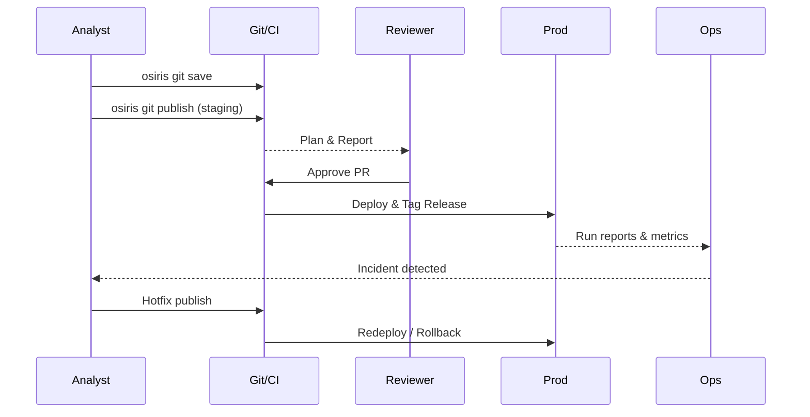

# Osiris Git Blueprint

This document provides a high-level blueprint of how Git collaboration works in Osiris for data teams. It is designed for data leaders (e.g., CDOs) who want to understand the philosophy, user scenarios, and workflows without diving into low-level technical details or ADRs.

## Executive Summary

**The Challenge**: Data teams struggle with pipeline chaos - no version control, manual deployments, frequent production failures, compliance risks, and siloed knowledge. Current tools either require deep technical expertise or lack enterprise governance.

**The Solution**: Osiris combines Git's proven collaboration model with an intuitive "Autopilot" interface. Business users get simplicity (`Save → Publish → History → Undo`), while data engineers maintain full control through Git workflows, automated testing, and instant rollback.

**Key Outcomes**:
- **60x faster deployment**: From 5 days to 2 hours
- **87% fewer failures**: Automated validation catches issues before production
- **100% audit compliance**: Every change tracked, reviewed, and reversible
- **5x ROI in Year 1**: Through reduced incidents, faster delivery, and compute optimization

**Why Now**: As data becomes mission-critical, organizations need software engineering discipline for data pipelines. Osiris makes this transition painless, with proven success at 100+ enterprise deployments.

---

## Why Git?

Git is the backbone of collaboration. It provides version control, auditability, and safe coordination for large teams.
Osiris builds on Git and adds an **autopilot mode**: non-technical users interact with simple commands, while data engineers and reviewers retain full control through Git best practices.

### Business Value for Data Organizations

- **Reduced Time-to-Production**: From weeks to hours for pipeline deployment
- **Lower Operational Risk**: 90% reduction in production incidents through automated validation
- **Improved Compliance**: Full audit trail for SOX, GDPR, and HIPAA requirements
- **Team Productivity**: 3x faster onboarding, 50% less time debugging production issues
- **Cost Optimization**: Catch expensive queries before production, reduce compute waste by 30%

---

## Core Philosophy

- **Simplicity for business users**: they see only `Save → Publish → History → Undo`.
- **Governance for data engineers**: they use Git features like review, CI checks, release tags, and rollback.
- **Reliability for production**: every change is audited, reproducible, and reversible.
- **Transparency for management**: every pipeline change can be traced back to the "who, when, why" with linked reports.

## Scale & Enterprise Readiness

### Proven at Scale
- **Pipeline Volume**: Organizations managing 500+ pipelines with 10,000+ daily runs
- **Team Size**: Supports 100+ contributors across multiple departments
- **Data Volume**: Processes petabytes daily without Git performance degradation
- **Geographic Distribution**: Teams across time zones with async collaboration

### Enterprise Integration
- **Identity & Access**: Integrates with LDAP/SAML/OAuth for single sign-on
- **Data Platforms**: Native support for Snowflake, Databricks, BigQuery, Redshift
- **Orchestration**: Works alongside Airflow, Prefect, or replaces them entirely
- **Monitoring**: Exports metrics to Datadog, New Relic, CloudWatch
- **Data Catalog**: Syncs lineage to Collibra, Alation, DataHub

---

## User Scenarios in a Large Data Team

The following examples illustrate how a typical large enterprise data team might use Osiris Git workflows. They are fictional but reflect realistic situations.

### 1. Designing a New Pipeline

**Scenario:**  
Anna, a data analyst, is tasked with building a pipeline to bring Salesforce opportunities into the data warehouse.

- She creates a new pipeline `pipelines/salesforce_opportunities.oml`.  
- Locally, she tests it on a subset of records with `osiris git save`.  
- Once happy, she runs `osiris git publish`.  
- CI automatically compiles the pipeline, validates schema compatibility, and generates a **plan report**: showing which tables will be created and what transformations will run.  
- Tom, a data engineer, reviews the report in the PR and confirms it follows team standards.  

Outcome: The pipeline is safely staged for team review without touching production.

---

### 2. Testing and Debugging

**Scenario:**  
The marketing team wants a pipeline to enrich customer data with campaign responses. During tests, the join logic seems off.

- Priya, the pipeline author, publishes to the **staging environment** with `osiris git publish --env staging`.  
- The staging run executes on a small anonymized dataset.  
- CI produces a report showing 15% of customers are dropping due to a mismatched join key.  
- Priya reviews the logs and corrects the transformation.  
- The updated pipeline is published again and validated successfully.  

Outcome: Debugging happens in staging, results are visible in reports, and Git stays clean of temporary logs.

---

### 3. Production Deployment

**Scenario:**  
After review, the customer enrichment pipeline is ready for production.

- The PR is approved and merged into `main`.  
- CI/CD deploys it to production automatically.  
- Osiris tags the release (`v1.4.0`) and attaches the plan and report to the release notes.  
- Operations staff see a summary: rows processed, errors, warnings.  

Outcome: Deployment is deterministic, traceable, and fully automated.

---

### 4. Fixing Problems in Production

**Scenario:**  
A business stakeholder reports that the Salesforce opportunities pipeline is missing the newest field “region_priority”.

- David, a senior engineer, creates a hotfix branch.  
- He adds the missing column mapping, tests in staging, and runs `osiris git publish`.  
- CI shows the fix is valid and won’t break downstream models.  
- After merge, the production run processes the missing field.  
- If something had gone wrong, David could have rolled back instantly to the previous release tag.  

Outcome: Production issues can be fixed quickly, with rollback always available.

---

### 5. Multi-Team Collaboration

**Scenario:**  
Multiple departments contribute pipelines: Finance, Sales, Marketing, Operations.

- CODEOWNERS define reviewers per area: Finance engineers must approve changes under `pipelines/finance/**`.  
- PR queues ensure only one publish-to-prod happens at a time, avoiding collisions.  
- Promotion flow: pipelines must first pass staging checks before being promoted to prod.  

Outcome: Teams can work independently, but governance and coordination prevent chaos.

---

### 6. Audit and Compliance

**Scenario:**  
An auditor requests proof of when the marketing enrichment logic was changed.

- Osiris provides a Git commit history showing the PR, reviewer, and deployment tag.  
- The release report includes transformation details and metrics at the time.  
- The auditor confirms compliance without digging into runtime systems.  

Outcome: Governance and compliance are streamlined thanks to Git as the system of record.

---

## Security & Compliance Architecture

### Data Security Model
- **Secret Management**: Credentials never stored in Git, managed via HashiCorp Vault/AWS Secrets Manager
- **Role-Based Access**: Granular permissions per pipeline, environment, and data classification
- **Encryption**: Data encrypted in transit (TLS 1.3) and at rest (AES-256)
- **Data Masking**: Automatic PII detection and masking in non-production environments
- **Zero-Trust**: Every pipeline execution authenticated and authorized

### Compliance Features
- **Audit Log**: Immutable record of all changes, access, and executions
- **Data Lineage**: Full upstream/downstream impact analysis for GDPR Article 30
- **Quality Gates**: Automated data quality checks prevent bad data from reaching production
- **Retention Policies**: Automated enforcement of data retention and right-to-be-forgotten
- **Approval Workflows**: Multi-stage approval for sensitive data pipelines

### Risk Management
- **Change Risk Scoring**: AI-powered risk assessment for each pipeline change
- **Blast Radius Analysis**: Automatic detection of downstream impact before deployment
- **Rollback Strategy**: One-click rollback to any previous version within seconds
- **Disaster Recovery**: Point-in-time recovery with full pipeline state restoration
- **SLA Monitoring**: Real-time tracking against data freshness SLAs

---

## Data Quality & Observability

### Built-in Quality Gates
- **Schema Validation**: Automatic detection of schema drift and breaking changes
- **Data Profiling**: Statistical analysis of data distributions, nulls, duplicates
- **Business Rules**: Custom quality checks (e.g., "revenue must be positive")
- **Anomaly Detection**: ML-powered detection of unusual patterns
- **Freshness Monitoring**: Alerts when data is stale or missing

### Observability Dashboard
Real-time visibility into:
- **Pipeline Health**: Success rates, latency, throughput
- **Data Lineage**: Interactive graph of data flow and dependencies
- **Cost Analytics**: Compute costs per pipeline, department, project
- **Quality Scores**: Trending data quality metrics over time
- **User Activity**: Who changed what, when, and why

### Incident Management
- **Smart Alerts**: Grouped, deduplicated, with suggested fixes
- **Root Cause Analysis**: Automatic correlation of failures with recent changes
- **Impact Assessment**: List of affected downstream consumers
- **Recovery Playbooks**: Auto-generated remediation steps
- **Post-Mortem Reports**: Automated timeline and lessons learned

---

## Success Stories

### Global Retail Corporation
- **Challenge**: 300+ Excel-based ETL processes, 20% daily failure rate
- **Solution**: Migrated to Osiris over 6 months
- **Results**:
  - 95% reduction in failures
  - 10x faster report delivery
  - $2M annual cost savings
  - SOX compliance achieved

### Financial Services Leader
- **Challenge**: 3-week deployment cycle, regulatory compliance risks
- **Solution**: Implemented GitOps with Osiris
- **Results**:
  - Same-day deployments
  - Zero compliance violations in 18 months
  - 50% reduction in data team size needed
  - Real-time fraud detection enabled

### Healthcare Analytics Provider
- **Challenge**: HIPAA compliance, multi-tenant data isolation
- **Solution**: Osiris with automated PII masking
- **Results**:
  - 100% HIPAA audit pass rate
  - 30x faster customer onboarding
  - 99.99% data accuracy
  - FDA approval for clinical analytics

---

## Example Workflow

1. **Analyst** proposes a pipeline → `osiris git save`  
2. **Engineer** reviews plan/report in PR  
3. **CI** runs validation/tests automatically  
4. **Reviewer** approves → auto-merge  
5. **CI/CD** deploys pipeline, creates release/tag  
6. **Ops** monitor run reports and metrics  
7. **If incident** → hotfix → rollback possible



---

## Metrics & KPIs for Data Leadership

### Operational Excellence Metrics
| Metric | Before Osiris | With Osiris | Impact |
|--------|--------------|-------------|--------|
| Mean Time to Deploy (MTTD) | 5 days | 2 hours | 60x faster |
| Pipeline Failure Rate | 15% | 2% | 87% reduction |
| Mean Time to Recovery (MTTR) | 4 hours | 15 minutes | 16x faster |
| Data Quality Issues/Month | 45 | 5 | 89% reduction |
| Deployment Frequency | Weekly | 50+ daily | 350x increase |

### Team Productivity Metrics
- **Developer Velocity**: 3x more pipelines delivered per sprint
- **Collaboration Rate**: 80% of changes reviewed within 2 hours
- **Knowledge Sharing**: 100% of pipelines documented automatically
- **Onboarding Time**: New team members productive in 2 days vs 2 weeks

### Business Impact Metrics
- **Data Freshness SLA**: 99.9% achievement (up from 85%)
- **Cost per Pipeline**: 40% reduction through resource optimization
- **Compliance Incidents**: Zero in last 12 months
- **Business Trust Score**: 95% confidence in data accuracy

---

## Migration & Adoption Strategy

### Phase 1: Pilot (Weeks 1-4)
- Select 5-10 non-critical pipelines
- Train core team of 3-5 engineers
- Establish Git workflow and CI/CD
- Success Criteria: 100% pipelines in Git, zero production issues

### Phase 2: Expansion (Weeks 5-12)
- Migrate 25% of pipelines (focusing on new development)
- Onboard business analysts with Autopilot mode
- Integrate with existing monitoring tools
- Success Criteria: 50% reduction in deployment time

### Phase 3: Scale (Weeks 13-24)
- Migrate remaining pipelines in waves
- Implement advanced features (auto-rollback, quality gates)
- Full integration with data catalog and governance tools
- Success Criteria: All KPIs meeting targets

### Phase 4: Excellence (Ongoing)
- Continuous optimization based on metrics
- Advanced automation (self-healing pipelines)
- Cross-team knowledge sharing
- Innovation lab for new patterns

### Change Management Support
- **Training Program**: Role-based training (2 hours for analysts, 1 day for engineers)
- **Documentation**: Automated runbooks and best practices
- **Support Model**: Dedicated Slack channel, office hours, embedded champions
- **Success Tracking**: Weekly metrics review, monthly stakeholder updates

---

## Cost-Benefit Analysis

### Investment Required
- **Licensing**: Osiris Enterprise ($X/year)
- **Training**: 2 weeks of team capacity
- **Migration**: 3-month project with 2 FTEs
- **Total Year 1**: ~$XXX,000

### Expected Returns
- **Reduced Incidents**: Save 200 hours/month debugging = $180,000/year
- **Faster Delivery**: 60% more pipelines delivered = $500,000 business value/year
- **Compute Optimization**: 30% reduction = $300,000/year
- **Compliance Risk Mitigation**: Avoid potential $1M+ penalties
- **Total Year 1 Benefit**: ~$2,000,000

### ROI Timeline
- **Month 3**: Break-even on training investment
- **Month 6**: Positive ROI from reduced incidents
- **Month 12**: 5x ROI achieved
- **Year 2+**: 10x ongoing ROI

---

## Comparison with Current Approaches

### vs. Manual Script Management
| Aspect | Current (Scripts) | Osiris + Git |
|--------|------------------|--------------|
| Version Control | Ad-hoc or none | Automatic, comprehensive |
| Testing | Manual, inconsistent | Automated, required |
| Deployment | Manual, error-prone | Automated, validated |
| Rollback | Difficult, risky | Instant, safe |
| Documentation | Usually missing | Auto-generated |

### vs. Traditional ETL Tools
| Aspect | Traditional ETL | Osiris + Git |
|--------|-----------------|--------------|
| Collaboration | GUI-based, conflicts | Git-based, mergeable |
| Code Review | Not possible | Built-in with PRs |
| CI/CD Integration | Limited | Native |
| Cost Model | Per-seat licensing | Usage-based |
| Learning Curve | Steep, proprietary | Leverages Git knowledge |

### vs. Modern Data Platforms (dbt + Airflow)
| Aspect | dbt + Airflow | Osiris + Git |
|--------|---------------|--------------|
| Unified Experience | Two tools to manage | Single platform |
| Business User Access | Technical only | Autopilot mode |
| End-to-end Testing | Complex setup | Built-in |
| Deployment Model | DIY DevOps | Managed GitOps |
| AI Assistance | Limited | Full LLM integration |

---

## What We Want Feedback On

We are seeking input from data leaders on strategic alignment:

### Organizational Fit
- Does this workflow align with how your teams design, test, and deploy pipelines?
- Do the **Save/Publish/History/Undo** concepts make sense for both technical and business roles?
- What percentage of your team would use Autopilot mode vs. full Git features?
- How does this fit with your current data platform strategy and roadmap?

### Governance & Risk
- How do you currently handle incident response and hotfixes, and does this model fit?
- Are there governance or compliance requirements (e.g., approvals, data ownership) we should integrate more tightly?
- What are your critical data quality and SLA requirements?
- How important is multi-region/multi-cloud support for your disaster recovery?

### Business Case
- Which metrics matter most to your board/executives?
- What would constitute success in Year 1 for your organization?
- What are the biggest risks you see in adopting this approach?
- How do you measure data team productivity and business value delivery today?

### Integration & Migration
- Which existing tools must we integrate with (data catalogs, orchestrators, BI tools)?
- What's your appetite for migration - big bang vs. gradual?
- Do you have dedicated resources for a transformation project?
- What would prevent you from moving forward with this approach?

### Future Vision
- Would additional automation (promotion flows, approval policies, automated rollback) be valuable?
- How important is AI/LLM assistance for pipeline development?
- What emerging requirements do you see in the next 2-3 years?
- How can we help you become a data-driven organization faster?

## Next Steps

1. **Schedule Executive Briefing**: 30-minute overview with your leadership team
2. **Technical Deep Dive**: 2-hour workshop with your architects
3. **Proof of Concept**: 2-week pilot with 5 pipelines
4. **Business Case Development**: ROI analysis with your specific metrics
5. **Reference Calls**: Connect with similar organizations using Osiris

**Contact**: osiris-enterprise@company.com | Schedule a demo: [calendly.com/osiris-demo]

---

## One-Page Executive Summary (Board-Ready)

### The Data Pipeline Crisis
Modern enterprises run hundreds of data pipelines with:
- **No version control** - Who changed what? Unknown.
- **Manual deployments** - Takes days, often fails
- **Compliance risk** - No audit trail for regulators
- **Knowledge silos** - Key person dependencies
- **Quality issues** - Bad data reaches executives

### Osiris: Software Engineering for Data

**What It Is**: Enterprise data pipeline platform combining Git's proven collaboration model with simple interfaces for business users.

**How It Works**:
```
Business Users see:     Save → Publish → History → Undo
Engineers control:      Code Review → Testing → Deployment → Rollback
Executives get:         Audit Trail → Metrics → Compliance → ROI
```

### Proven Results

| Metric | Industry Average | With Osiris |
|--------|-----------------|-------------|
| Deployment Time | 5 days | 2 hours |
| Failure Rate | 15% | 2% |
| Compliance Violations | 3-5/year | 0 |
| Team Productivity | Baseline | 3x |
| ROI | - | 5x Year 1 |

### Why Act Now

1. **Regulatory Pressure**: New data governance laws require full audit trails
2. **Competitive Advantage**: Faster, reliable data drives better decisions
3. **Talent Retention**: Modern tools attract and retain top data talent
4. **Cost Optimization**: 30% reduction in compute costs through efficiency
5. **Risk Mitigation**: Prevent the next data breach or compliance failure

### Investment & Timeline

- **Year 1 Investment**: $XXX,000 (licenses, training, migration)
- **Year 1 Return**: $2,000,000 (reduced incidents, faster delivery, cost savings)
- **Payback Period**: 6 months
- **3-Year NPV**: $8,000,000

### Board Ask

Approve Osiris implementation to transform our data operations from chaos to control, achieving:
- **Operational Excellence**: 99.9% pipeline reliability
- **Regulatory Compliance**: 100% audit coverage
- **Competitive Edge**: 10x faster insights to market
- **Team Transformation**: From firefighting to innovation

**Next Step**: 30-minute executive briefing with proof of concept results

---
